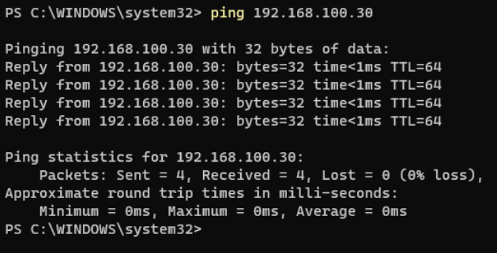
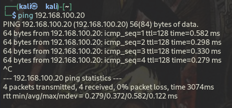
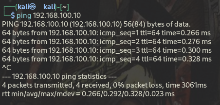

# Static IP Assignments

This document outlines the static IP configuration applied to each virtual machine in the SOC homelab. Static IPs are used in place of DHCP to ensure consistent addressing across all machines, which is critical for Wazuh agent-to-manager communication and reliable attack simulation targeting.

## Network Information

| Property | Value |
|---|---|
| Network Type | VMware LAN Segment (Isolated) |
| Subnet | 192.168.100.0/24 |
| Subnet Mask | 255.255.255.0 |
| Gateway | N/A (Isolated — no gateway) |
| DHCP | Disabled |
| Internet Access | None |

## IP Assignment Table

| Machine | OS | IP Address | Subnet Mask | Role |
|---|---|---|---|---|
| Ubuntu Server | Ubuntu Server 24 | 192.168.100.10 | 255.255.255.0 | SIEM Server (Wazuh) |
| Windows 11 | Windows 11 Home | 192.168.100.20 | 255.255.255.0 | Target Endpoint |
| Kali Linux | Kali Linux 2025.4 | 192.168.100.30 | 255.255.255.0 | Attack Machine |

## Connectivity Verification

Connectivity between all machines was verified using ping after static IP assignment.

### Windows 11 → Ubuntu Server
```
ping 192.168.100.10
```


### Windows 11 → Kali Linux
```
ping 192.168.100.30
```



### Kali Linux → Windows 11
```
ping 192.168.100.20
```



### Kali Linux → Ubuntu Server
```
ping 192.168.100.10
```



## Configuration Notes

- All static IPs were assigned manually through each VM's network settings
- No default gateway is configured on any machine as the LAN Segment has no routing to external networks
- DNS is not configured as all communication occurs directly via IP address within the isolated segment
- IP assignments were confirmed stable across VM reboots before proceeding with Wazuh installation
