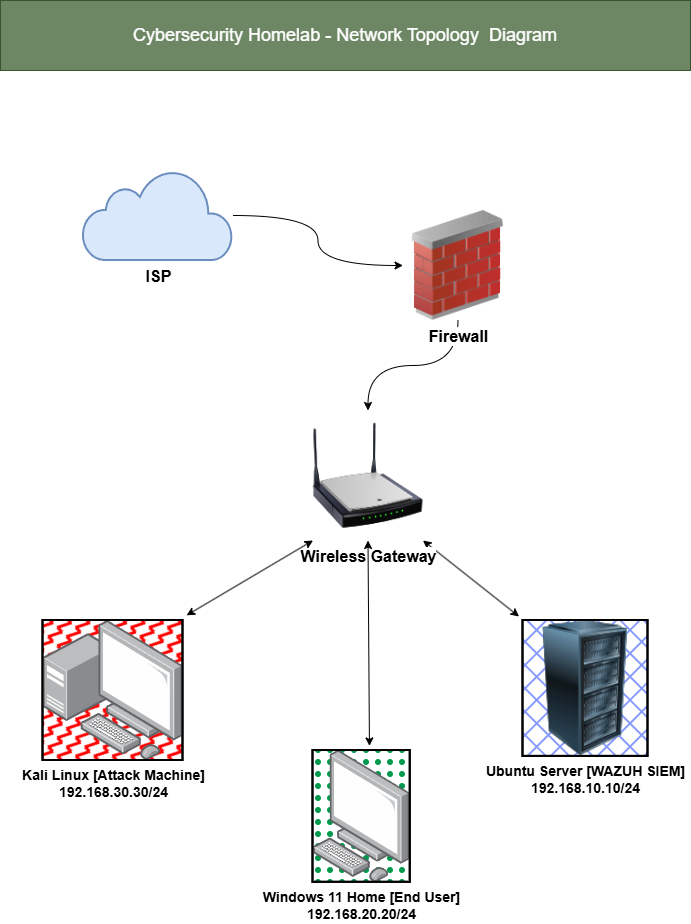

# Core Lab

This is the core SOC homelab: a cybersecurity learning environment built for hands-on experience with network segmentation, SIEM operations, and threat simulation. The lab runs on VMware Workstation Pro and consists of four virtual machines: a pfSense router/firewall, an Ubuntu Server running the Wazuh SIEM stack, a Windows 11 target endpoint, and a Kali Linux attack machine. Each device sits on its own isolated network segment, with all traffic routed and controlled through pfSense.

## Network Diagram



Full rationale for this design, including why each device and technology was chosen and how the network is addressed, is documented in the [Architecture Overview](architecture/architecture-overview.md).

## Repository Structure

```
core-lab/
├── README.md
├── architecture/
│   ├── README.md
│   └── architecture-overview.md
├── setup/
│   ├── README.md
│   ├── vmware-setup.md
│   ├── pfsense-setup.md
│   ├── ubuntu-setup.md
│   ├── windows-setup.md
│   ├── kali-setup.md
│   ├── wazuh-setup.md
│   └── sysmon-setup.md
└── images/
    └── (screenshots and diagrams referenced throughout the documentation)
```

- **architecture/** - explains why the lab is designed the way it is: device rationale, network segmentation, and IP addressing
- **setup/** - step by step installation and configuration guides for every component in the lab
- **images/** - all screenshots and diagrams referenced across the documentation

## Quick Links

- [Architecture Overview](architecture/architecture-overview.md) - device rationale, network topology, and IP addressing scheme
- [Setup Guide Index](setup/README.md) - recommended install order and a summary of every component's purpose

## Getting Started

To build this lab from scratch, start with the [Setup Guide Index](setup/README.md), which lists every component in the order it should be installed. For the reasoning behind the lab's design before diving into setup, start with the [Architecture Overview](architecture/architecture-overview.md) instead.
