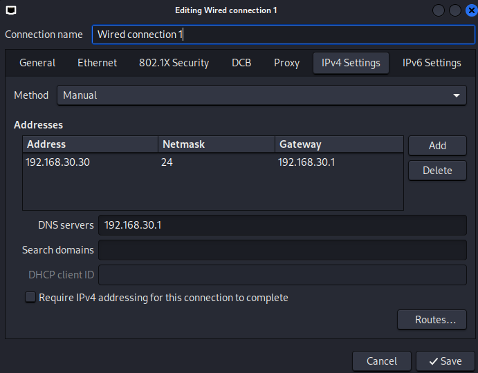
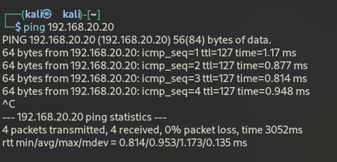

# Kali Linux Setup

This document covers the setup and configuration of the Kali Linux virtual machine in the SOC homelab. Kali Linux serves as the attack machine in the lab, used to simulate threat actor behavior against the Windows 11 target endpoint. All attack activity from this machine is contained within the lab's internal LAN segments and does not affect any external systems or networks.

## VM Specifications

| Property | Value |
|---|---|
| Operating System | Kali Linux 2025.1 |
| RAM | 4GB |
| CPUs | 2 |
| Storage | 80.1GB |
| Network Adapter | 1 (SOC-Lab-Kali segment) |
| IP Address | 192.168.30.30 |
| Gateway | 192.168.30.1 (pfSense) |
| Role | Attack Machine |

## Installation

Kali Linux was deployed using the prebuilt Kali Linux VMware virtual machine image rather than a manual ISO installation. The official Kali Linux VMware image can be downloaded from [https://www.kali.org/get-kali/#kali-virtual-machines](https://www.kali.org/get-kali/#kali-virtual-machines).
 
The downloaded image was extracted, then opened directly in VMware Workstation Pro. No manual operating system installation steps were required. See [VMware Setup](vmware-setup.md) for VM hardware allocation.

The screenshot below confirms the Kali Linux VM is fully imported and operational.


## Network Configuration

A static IP address was manually assigned to the Kali Linux VM using the NetworkManager GUI (nm-applet) to ensure consistent addressing on the SOC-Lab-Kali segment. DNS is pointed at the pfSense gateway, which forwards DNS queries upstream to 8.8.8.8 and 1.1.1.1.

### Static IP Assignment

| Property | Value |
|---|---|
| IP Address | 192.168.30.30 |
| Subnet Mask | 255.255.255.0 |
| Gateway | 192.168.30.1 |
| DNS | 192.168.30.1 (pfSense) |

The screenshot below shows the NetworkManager GUI confirming the static IP, gateway, and DNS assigned to the Kali Linux network adapter.



## System Update

After the VM was imported and network connectivity was confirmed, the system package list and all installed packages were updated to ensure the latest libraries and security patches were in place before use in the lab.
```bash
sudo apt update && sudo apt upgrade -y
```

## Connectivity Verification

After static IP assignment, connectivity was verified by pinging the Windows 11 target endpoint on the SOC-Lab-Windows segment to confirm that attack traffic can reach its intended destination across segments.

### Kali Linux to Windows 11
Confirms that traffic from the Kali segment can reach the Windows target endpoint on a different segment.
```bash
ping 192.168.20.20
```



This successful cross-segment ping reflects the current default state of the pfSense firewall rules, which have not yet been customized to restrict traffic between segments. Intentional access control between the Kali segment and other segments is planned as a future project.

## Configuration Notes

- All attack activity is currently contained within the lab's internal LAN segments and does not affect any external systems or networks
- Internet access is available through pfSense via VMware NAT for package updates and tool downloads as needed
- DNS resolution routes through the pfSense gateway, which forwards queries to 8.8.8.8 and 1.1.1.1
