# pfSense Setup

This document covers the installation and configuration of the pfSense firewall virtual machine in the SOC homelab. pfSense sits at the network perimeter and routes traffic between three isolated internal LAN segments and the internet via VMware NAT. It provides network level visibility and routing that complements the endpoint level detection provided by Wazuh on the connected segments.

## Why pfSense

pfSense was chosen as the network firewall and router for this lab for the following reasons:

**Open Source** - pfSense CE is completely free and open source with no licensing restrictions, making it suitable for homelab use without cost.

**Enterprise Relevance** - pfSense is widely deployed in real enterprise environments, making it directly relevant to SOC and network engineering roles.

**Network Segmentation** - pfSense allows each lab device to sit on its own isolated LAN segment with its own gateway, mirroring how real enterprise networks separate systems by function and trust level.

**Controlled Internet Access** - pfSense provides controlled internet access through VMware NAT while keeping each internal LAN segment isolated from the host machine's physical network and from each other.

## VM Specifications

| Property | Value |
|---|---|
| Operating System | pfSense CE 2.7.2 |
| RAM | 1GB |
| CPUs | 1 |
| Storage | 20GB |
| Network Adapters | 4 total (1 WAN, 3 LAN) |
| Role | Firewall / Router |

The screenshot below shows the VMware LAN Segment configuration for the three internal segments used by this VM.

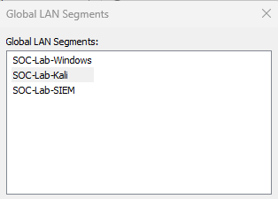

## Network Segmentation Overview

Each lab device sits on its own isolated LAN segment, connected to pfSense through a dedicated network adapter. The VMware LAN Segments are named to match the device they serve:

| VMware LAN Segment Name | Subnet | Connected Device |
|---|---|---|
| SOC-Lab-SIEM | 192.168.10.0/24 | Ubuntu Server (Wazuh) |
| SOC-Lab-Windows | 192.168.20.0/24 | Windows 11 Client |
| SOC-Lab-Kali | 192.168.30.0/24 | Kali Linux Attack Machine |

## Installation

pfSense CE 2.7.2 was installed as a virtual machine in VMware Workstation using the official pfSense CE ISO. The official pfSense CE ISO can be downloaded from [https://www.pfsense.org/download](https://www.pfsense.org/download).

During installation, the following options were selected:

| Option | Value |
|---|---|
| Partition Scheme | GPT |
| Filesystem | UFS |
| All other settings | Default |

## Interface Assignment

On first boot, pfSense prompts for interface assignment. With four network adapters attached to the VM (one WAN and three LAN segments), the following assignments were made:

| Interface | NIC | VMware LAN Segment | Purpose |
|---|---|---|---|
| WAN | em1 | NAT | Internet access via VMware NAT |
| LAN | em2 | SOC-Lab-SIEM | Gateway for Wazuh SIEM segment |
| OPT1 | em3 | SOC-Lab-Windows | Gateway for Windows 11 client segment |
| OPT2 | em4 | SOC-Lab-Kali | Gateway for Kali Linux attack segment |

The screenshot below confirms this mapping in the pfSense interface.

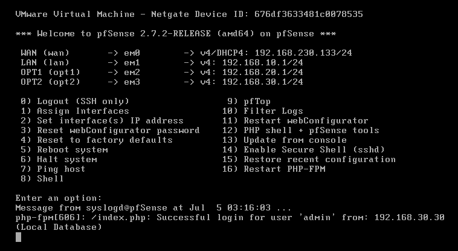

Each LAN interface was assigned a static IP acting as the default gateway for its segment:

| Interface | IP Address | Subnet Mask |
|---|---|---|
| LAN | 192.168.10.1 | 255.255.255.0 |
| OTP1 | 192.168.20.1 | 255.255.255.0 |
| OTP2 | 192.168.30.1 | 255.255.255.0 |

The screenshots below show each LAN interface configuration page.

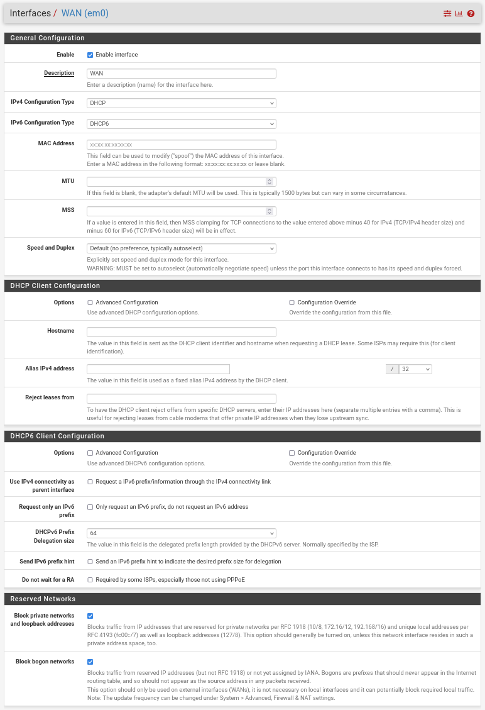

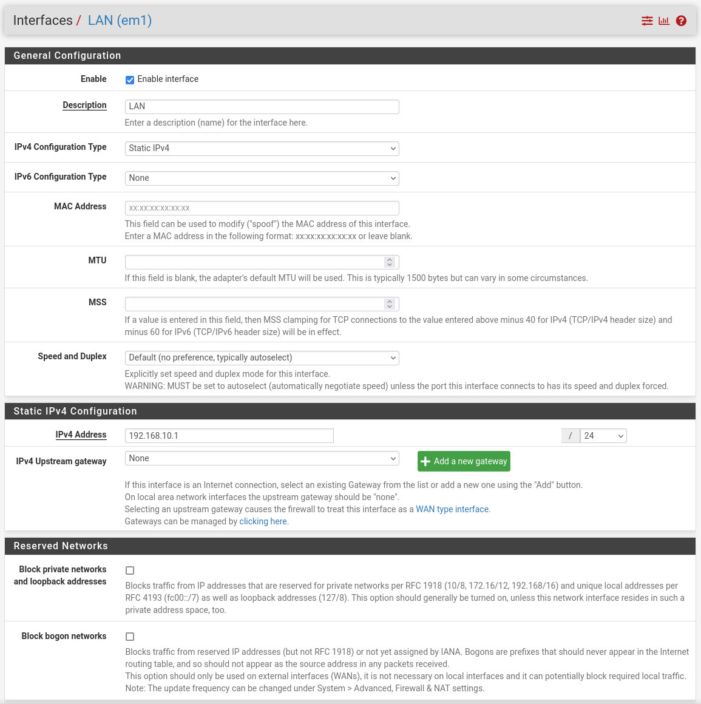

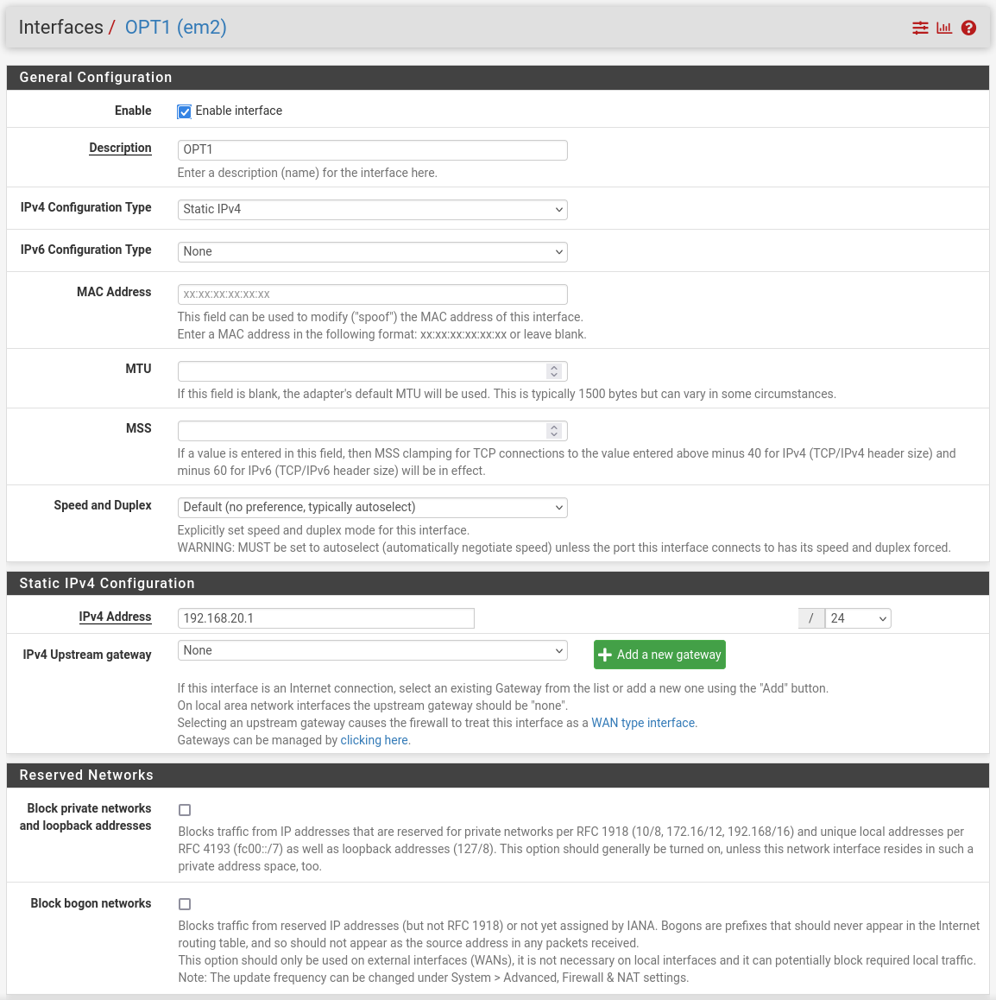

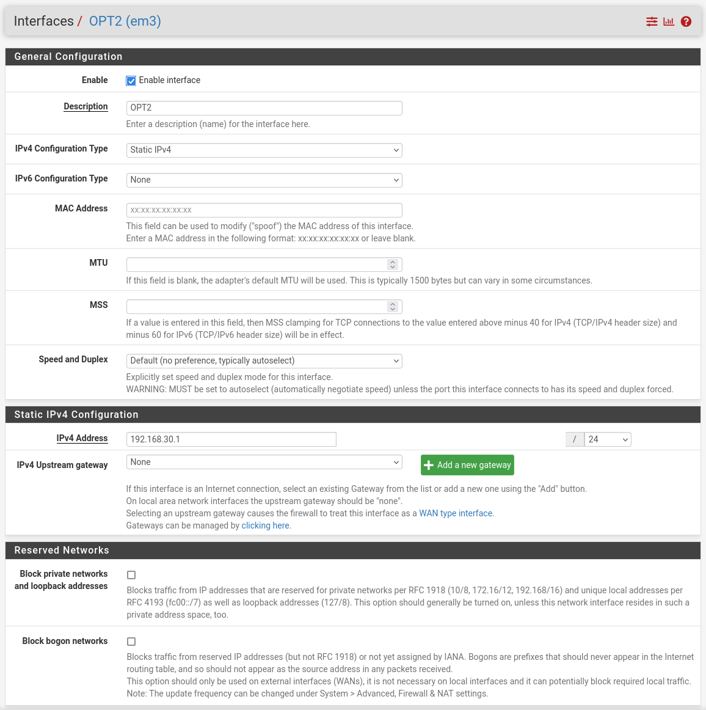

## Initial Configuration Wizard

On first login to the pfSense web dashboard, the setup wizard was completed with the following configuration:

### General Information

| Field | Value |
|---|---|
| Hostname | pfsense |
| Domain | soc.local |
| Primary DNS | 8.8.8.8 (Google) |
| Secondary DNS | 1.1.1.1 (Cloudflare) |
| Override DNS | Enabled |

### WAN Configuration
Left as DHCP - VMware NAT automatically assigns the WAN IP address.

### Admin Password
The default admin password was changed to a secure password during the setup wizard.

The screenshot below shows the General Setup page confirming hostname, domain, and DNS configuration.

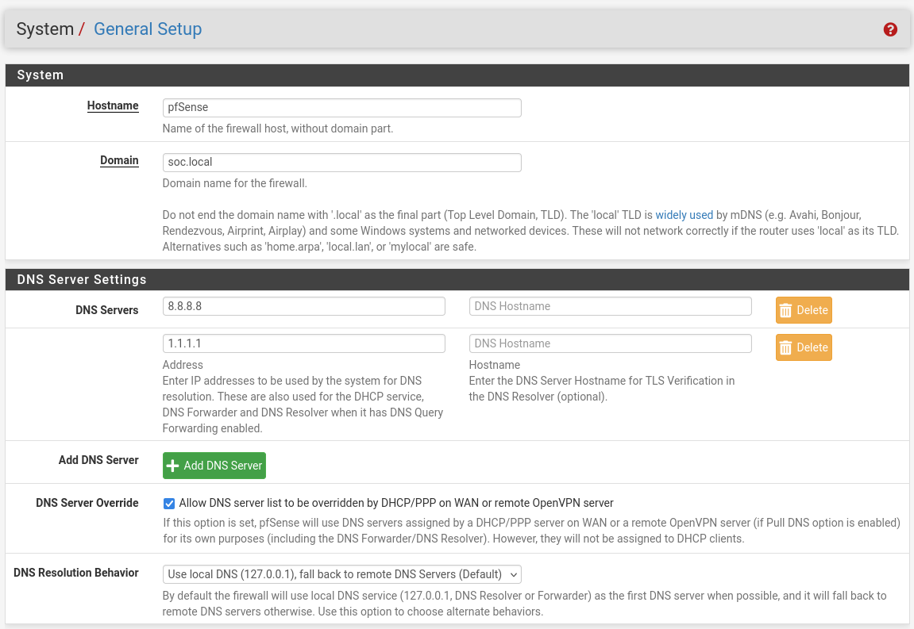

## Accessing the Dashboard

The pfSense web dashboard is accessible from any internal segment using the corresponding LAN gateway address, for example from the Windows 11 VM browser at:
```
https://192.168.20.1
```

A self-signed SSL certificate is used by default, which causes the browser to display a security warning on first access. This is expected behavior - proceed by clicking **Advanced > Proceed** to access the dashboard.

The screenshot below shows the pfSense dashboard confirming all four interfaces (WAN, LAN10, LAN20, LAN30) are active.

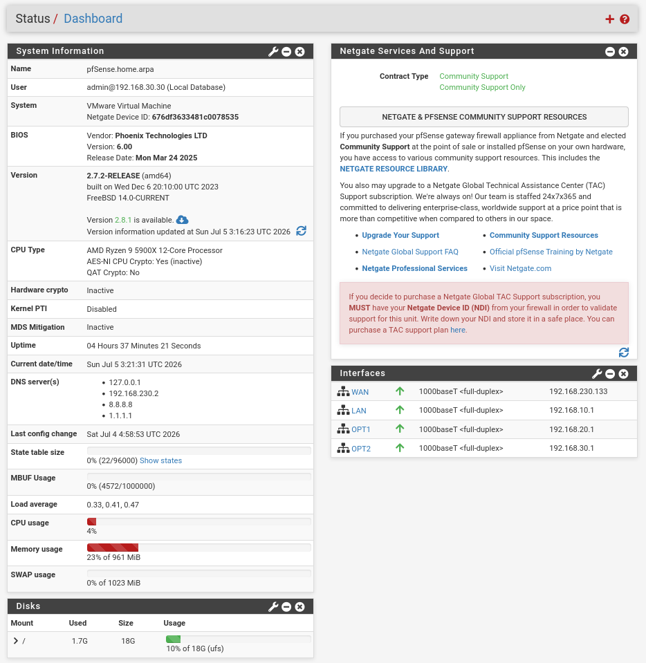

## Firewall Rules

At this stage of the lab, firewall rules have not been customized beyond what pfSense generates automatically when an interface is assigned. Each interface currently runs on its default rule set, which permits basic traffic on that segment but does not yet enforce any intentional access control between segments.

The screenshots below show the default rule state for each interface.

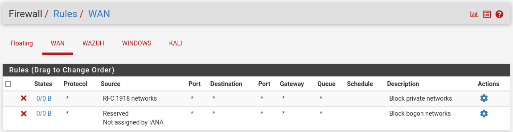

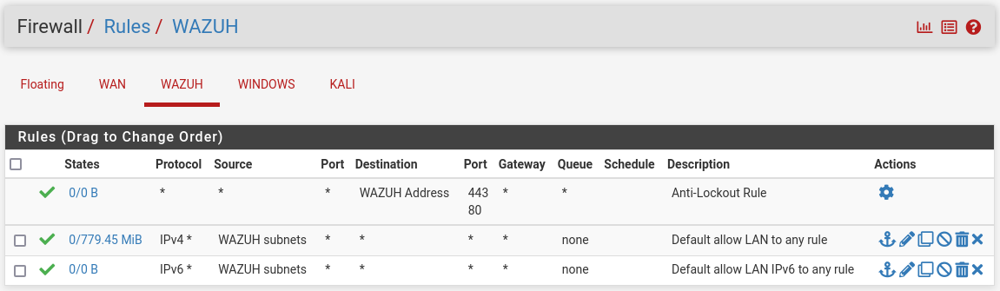

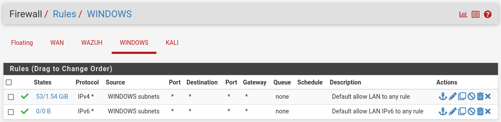

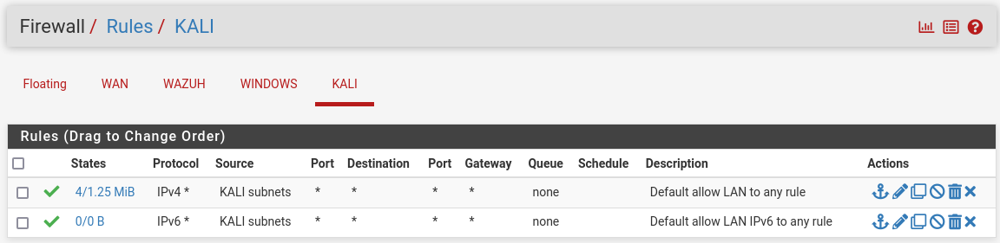

Custom rule design, such as restricting the Kali segment from initiating traffic toward the Windows or SIEM segments except during controlled exercises, is planned as a future project and will be documented separately once implemented.

## Connectivity Verification

After pfSense was fully configured, connectivity was verified from all three internal segments.

The following combined ping test confirms all three devices are reachable through their respective pfSense gateway interfaces:
```
ping 192.168.10.10
ping 192.168.20.20
ping 192.168.30.30
```

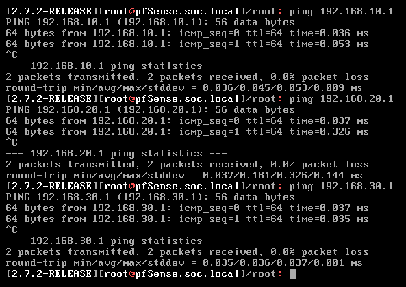

The following ping test confirms internet routing through pfSense is working correctly for both configured DNS servers:
```
ping 8.8.8.8
ping 1.1.1.1
```


## Configuration Notes

- pfSense must always be the first VM booted and the last VM shut down - all other VMs depend on pfSense for gateway routing and internet access
- The WAN interface receives its IP automatically from VMware NAT - no static WAN IP is configured
- DNS queries from all VMs are forwarded upstream through pfSense to 8.8.8.8 and 1.1.1.1
- The pfSense dashboard uses a self-signed SSL certificate by default - the browser security warning on first access is expected and can be safely bypassed within the lab environment
- The default admin password was changed during the initial setup wizard
- Firewall rules are currently at default state only, access control hardening between segments is deferred to a future project
- Full pfSense documentation is available at [https://docs.netgate.com/pfsense/en/latest](https://docs.netgate.com/pfsense/en/latest)
