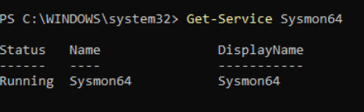
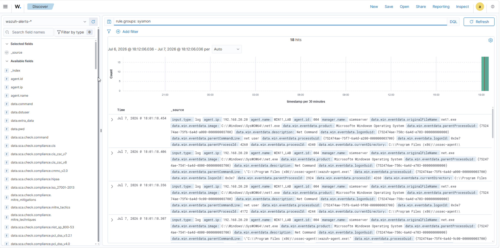

# Sysmon Setup

This document covers the installation and configuration of Sysmon on the Windows 11 target endpoint. Sysmon is a Microsoft Sysinternals tool that is used to enhance the quality and detail of endpoint logs collected by the Wazuh agent, providing clarifying information, network connections, and file system activity that standard Windows Event Logs do not capture.

## Prerequisites
 
Before installing Sysmon, the Windows 11 VM must be fully installed and configured, including static IP assignment and the Wazuh agent already installed and reporting to the Wazuh Manager. Full details are documented in [Windows 11 Setup](windows-setup.md).

## Download

Sysmon is part of the Microsoft Sysinternals suite. For this lab, Sysmon version 15.15 was used, but the latest version can be downloaded directly from the [Microsoft Sysinternals official download page](https://learn.microsoft.com/en-us/sysinternals/downloads/sysmon). The zip archive contains four files:

| File | Description |
|---|---|
| Sysmon.exe | 32-bit version, not used |
| Sysmon64.exe | 64-bit version, used for this lab |
| Sysmon64a.exe | ARM 64-bit version, not used |
| Eula.txt | License agreement |

Since Windows 11 is a 64-bit operating system, **Sysmon64.exe** is the correct binary for this lab.

The Sysmon folder was saved to `C:\Tools\Sysmon\` for permanent storage. This location is important as the executable is required for future updates, configuration changes, or reinstallation.

## Installation

Sysmon was installed via PowerShell running as Administrator. Navigate to the Sysmon folder and run:
```powershell
cd C:\Tools\Sysmon
.\Sysmon64.exe -accepteula -i
```

The `-accepteula` flag silently accepts the license agreement, and `-i` initiates the installation.

## Verify Sysmon is Running

After installation, confirm Sysmon is running as a service:
```powershell
Get-Service Sysmon64
```

Expected output should show **Status: Running**.

The screenshot below confirms the Sysmon64 service is running.



## Auto-Start on Boot

Sysmon was configured to start automatically on system boot, so it does not need to be manually started each session. This was configured via the Windows Services manager (`services.msc`) by setting the Sysmon64 service Startup Type to **Automatic**.

## Wazuh Integration

No additional configuration is required on the Wazuh side to begin collecting Sysmon logs once the Sysmon log channel has been added to `ossec.conf`. Full details on the `ossec.conf` configuration and agent deployment are documented in [Wazuh Setup](wazuh-setup.md).

Sysmon events appear in the Wazuh dashboard under the Windows agent's event log view and can be filtered using:
```
rule.groups: sysmon
```

The screenshot below shows Sysmon events appearing in the Wazuh dashboard.



## Configuration Notes

- Sysmon64.exe is stored permanently at `C:\Tools\Sysmon\` and should not be deleted
- No custom Sysmon configuration file has been applied, Sysmon is running with default settings
- A future improvement is to apply a community ruleset, such as the SwiftOnSecurity Sysmon config, to further improve detection coverage and reduce noise
- Sysmon version can be checked by running `.\Sysmon64.exe` with no arguments in the installation directory
