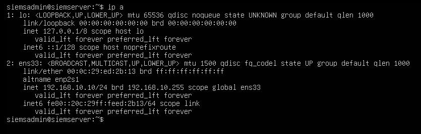
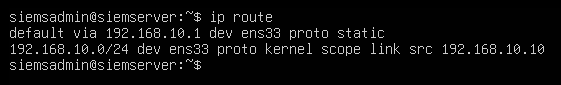
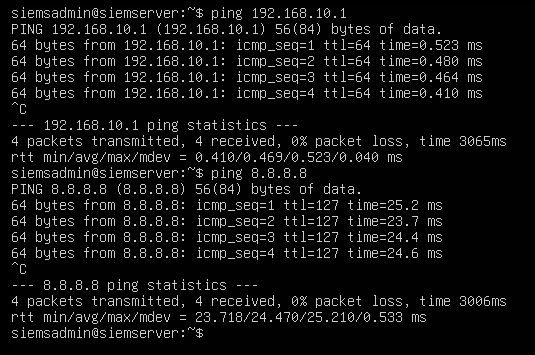

# Ubuntu Server Setup

This document covers the installation and configuration of the Ubuntu Server virtual machine in the SOC homelab. This VM hosts the Wazuh SIEM stack (Wazuh Manager, Wazuh Indexer, and Wazuh Dashboard). Full Wazuh installation and service configuration details are documented separately in [Wazuh Setup](wazuh-setup.md); this document covers the underlying operating system only.

## VM Specifications

| Property | Value |
|---|---|
| Operating System | Ubuntu Server 24.04 LTS (headless) |
| RAM | 4GB |
| CPUs | 2 |
| Storage | 80GB |
| Network Adapter | 1 (SOC-Lab-SIEM segment) |
| IP Address | 192.168.10.10 |
| Gateway | 192.168.10.1 (pfSense) |
| Role | SIEM Server (Wazuh) |

## Installation

Ubuntu Server 24.04 LTS was installed as a virtual machine in VMware Workstation Pro using the official Ubuntu Server ISO, available at [the official Ubuntu Server download](https://ubuntu.com/download/server). See [VMware Setup](vmware-setup.md) for VM hardware allocation.

No desktop environment was installed; Ubuntu Server runs headless via terminal only, which reduces resource usage and reflects how servers are typically managed in real enterprise environments.

The screenshot below confirms the Ubuntu Server VM is fully installed and operational.


## Network Configuration

A static IP address was manually assigned to the Ubuntu Server VM to ensure consistent addressing on the SOC-Lab-SIEM segment. This is important for Wazuh agent-to-manager communication, since monitored endpoints are configured to point to this fixed IP address.

### Static IP Assignment

| Property | Value |
|---|---|
| IP Address | 192.168.10.10 |
| Subnet Mask | 255.255.255.0 |
| Gateway | 192.168.10.1 |
| DNS | 192.168.10.1 (pfSense) |

The static IP address was assigned by editing the netplan configuration file:
```bash
sudo nano /etc/netplan/50-cloud-init.yaml
```

The following configuration was applied:
```yaml
network:
  ethernets:
    ens33:
      dhcp4: no
      addresses: [192.168.10.10/24]
      nameservers:
        addresses: [192.168.10.1]
      routes:
        - to: default
          via: 192.168.10.1
  version: 2
```

Changes were applied with:
```bash
sudo netplan apply
```

The screenshot below shows the output of `ip a` confirming the static IP address is active on the Ubuntu Server VM.



The screenshot below shows the output of `ip route` confirming the default gateway is correctly set to 192.168.10.1.



## System Update

After installation, the system package list and all installed packages were updated to ensure the latest libraries and security patches are in place before Wazuh installation.
```bash
sudo apt update && sudo apt upgrade -y
```

## Connectivity Verification

After static IP assignment, basic connectivity was verified from the Ubuntu Server VM.
```bash
ping 192.168.10.1
ping 8.8.8.8
```

The first command confirms the pfSense gateway is reachable on the SOC-Lab-SIEM segment. The second command confirms internet routing through pfSense is working correctly.



## Configuration Notes

- Ubuntu Server runs headless with no desktop environment installed, reducing RAM and CPU overhead and leaving more resources available for the Wazuh stack
- DNS resolution routes through the pfSense gateway, which forwards queries to 8.8.8.8 and 1.1.1.1
- Internet access is available through pfSense via VMware NAT for package updates as needed
- Full Wazuh installation, service management, and dashboard access are covered in [Wazuh Setup](wazuh-setup.md)
