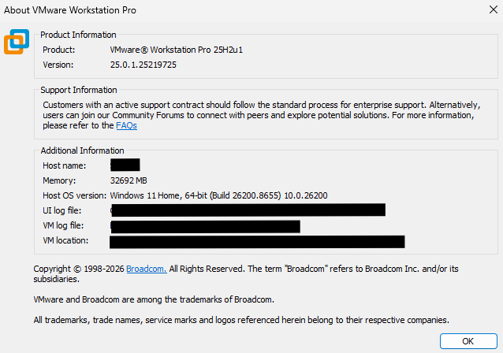
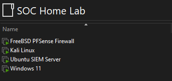
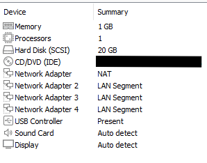
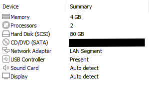
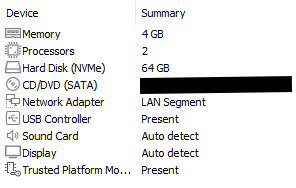
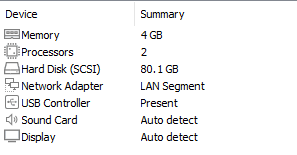

# VMware Setup and Network Connectivity

This document covers the installation of VMware Workstation Pro on the host machine and the configuration of every virtual machine in the SOC homelab, including resource allocation and network connectivity. Detailed installation and configuration steps specific to each VM's operating system and role are covered in that VM's own setup document, referenced throughout this file.

## Host Environment

| Property | Value |
|---|---|
| Hypervisor | VMware Workstation Pro |
| Hypervisor Type | Type 2 (hosted) |
| Host Operating System | Windows |

VMware Workstation Pro is now free for personal use and no longer requires a paid license key for non-commercial homelab use.

## Downloading and Installing VMware Workstation Pro

1. Download VMware Workstation Pro for Windows from the official Broadcom site: [https://www.vmware.com/products/desktop-hypervisor/workstation-and-fusion](https://www.vmware.com/products/desktop-hypervisor/workstation-and-fusion)
2. Run the downloaded installer as Administrator.
3. Accept the license agreement and proceed with default installation settings unless a custom install path is required.
4. Once installation completes, restart the host machine if prompted.
5. Launch VMware Workstation Pro and complete the free personal use registration when prompted; no license key purchase is required.

The screenshot below confirms a successful installation.

## Lab Virtual Machines

The lab consists of four virtual machines: one pfSense router/firewall and three isolated device VMs, each connected to pfSense through its own dedicated LAN Segment. The screenshot below shows all four VMs together in the VMware Workstation Pro library.

### pfSense (Router / Firewall)

pfSense is installed from the official pfSense CE ISO, available at [https://www.pfsense.org/download](https://www.pfsense.org/download).

| Property | Value |
|---|---|
| Operating System | pfSense CE 2.7.2 |
| RAM | 1GB |
| CPUs | 1 |
| Storage | 20GB |
| Network Adapters | 4 (1 WAN/NAT, 3 LAN) |

The screenshot below shows the pfSense VM hardware settings, confirming allocated resources and all four network adapters.

Full pfSense installation, interface assignment, and initial configuration are covered in the [pfSense Setup](pfsense-setup.md) document.

### Ubuntu Server (Wazuh SIEM)

Ubuntu Server 24.04 LTS is used as a headless host for the Wazuh SIEM, installed from the official ISO at [https://ubuntu.com/download/server](https://ubuntu.com/download/server).

| Property | Value |
|---|---|
| Operating System | Ubuntu Server 24.04 LTS (headless) |
| RAM | 4GB |
| CPUs | 2 |
| Storage | 80GB |
| Network Adapters | 1 (SOC-Lab-SIEM segment) |

The screenshot below shows the Ubuntu Server VM hardware settings, confirming allocated resources and its network adapter on the SOC-Lab-SIEM segment.

Full installation and Wazuh configuration steps are covered in the [Ubuntu Server Setup](ubuntu-setup.md) document.

### Windows 11 Client

The Windows 11 client is installed from the official Windows 11 ISO obtained through the Microsoft Media Creation Tool at [https://www.microsoft.com/software-download/windows11](https://www.microsoft.com/software-download/windows11). This VM also runs Sysmon to support endpoint log collection.

| Property | Value |
|---|---|
| Operating System | Windows 11 |
| RAM | 4GB |
| CPUs | 2 |
| Storage | 64GB |
| Network Adapters | 1 (SOC-Lab-Windows segment) |

The screenshot below shows the Windows 11 VM hardware settings, confirming allocated resources and its network adapter on the SOC-Lab-Windows segment.

Full installation and Sysmon configuration steps are covered in the [Windows 11 Client Setup](windows-setup.md) document.

### Kali Linux (Attack Machine)

Kali Linux uses the prebuilt VMware virtual machine image provided by Offensive Security, available at [https://www.kali.org/get-kali/#kali-virtual-machines](https://www.kali.org/get-kali/#kali-virtual-machines). This image only needs to be extracted and opened in VMware Workstation Pro, no manual OS installation is required.

| Property | Value |
|---|---|
| Operating System | Kali Linux |
| RAM | 4GB |
| CPUs | 2 |
| Storage | 80.1GB |
| Network Adapters | 1 (SOC-Lab-Kali segment) |

The screenshot below shows the Kali Linux VM hardware settings, confirming allocated resources and its network adapter on the SOC-Lab-Kali segment.

Full configuration steps are covered in the [Kali Linux Setup](kali-setup.md) document.

## Network Accessibility

Each device VM connects to pfSense through its own dedicated VMware LAN Segment, isolating it from the host machine's physical network and from the other device VMs at the network layer. pfSense itself connects to the internet through VMware NAT on its WAN interface. Static IP addresses are configured locally on each guest operating system rather than through DHCP reservations on pfSense.

| VM Name | VMware LAN Segment | Subnet | Static IP | Default Gateway |
|---|---|---|---|---|
| pfSense (WAN) | NAT | Host assigned | DHCP via VMware NAT | N/A |
| pfSense (LAN) | SOC-Lab-SIEM | 192.168.10.0/24 | 192.168.10.1 | N/A |
| pfSense (OTP1) | SOC-Lab-Windows | 192.168.20.0/24 | 192.168.20.1 | N/A |
| pfSense (OTP2) | SOC-Lab-Kali | 192.168.30.0/24 | 192.168.30.1 | N/A |
| Ubuntu Server | SOC-Lab-SIEM | 192.168.10.0/24 | 192.168.10.10 | 192.168.10.1 |
| Windows 11 Client | SOC-Lab-Windows | 192.168.20.0/24 | 192.168.20.20 | 192.168.20.1 |
| Kali Linux | SOC-Lab-Kali | 192.168.30.0/24 | 192.168.30.30 | 192.168.30.1 |

## Configuration Notes

- VMware Workstation Pro is free for personal use; no license purchase is required for this lab
- pfSense must be powered on first and powered off last, since all other VMs depend on it for gateway routing and internet access
- Each device VM has a single network adapter connected to its assigned LAN Segment, keeping it isolated from the other segments at the network layer
- Static IP addressing is used throughout the lab instead of DHCP reservations, configured directly on each guest operating system
- VMware LAN Segments are named to match their connected device (SOC-Lab-SIEM, SOC-Lab-Windows, SOC-Lab-Kali) for clarity when managing virtual network adapters in VMware
- Kali Linux uses a prebuilt VMware VM image rather than a manual ISO install; pfSense, Ubuntu, and Windows are each installed manually from their official ISOs
- Device purpose, rationale for tool/OS selection, and IP addressing justification are intentionally not covered in this document; they are reserved for the future architecture overview
