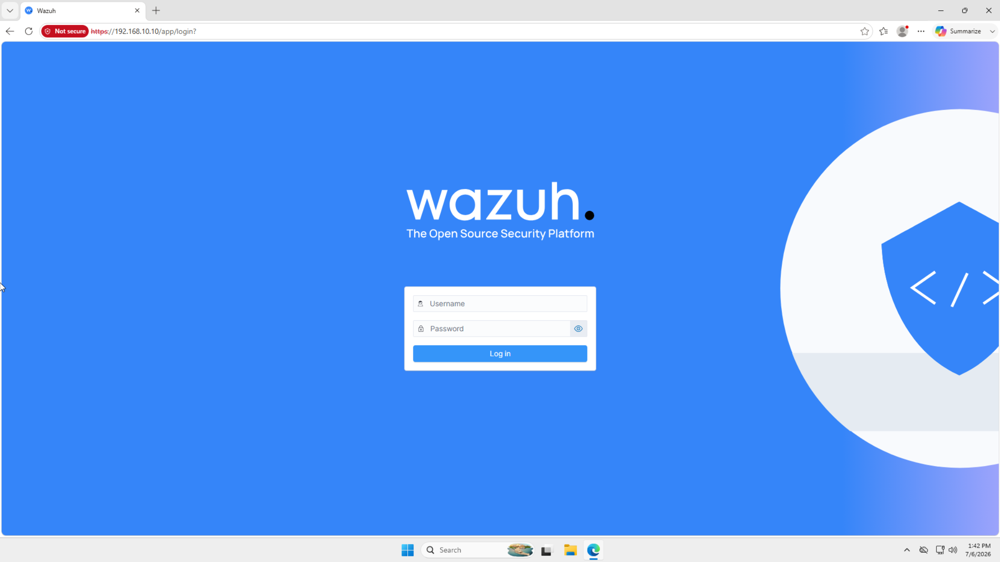
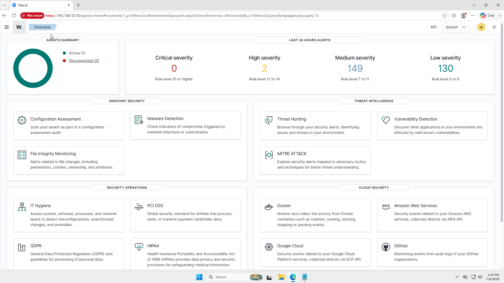
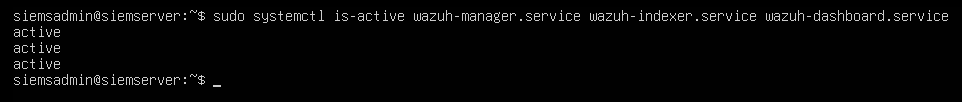
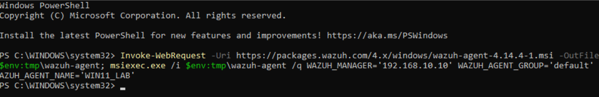
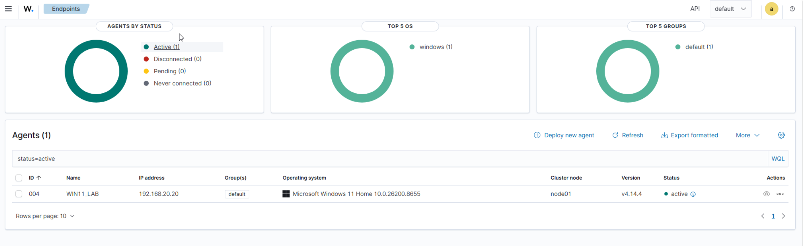

# Wazuh Setup

This document covers the installation and configuration of the Wazuh SIEM stack on the Ubuntu Server VM, as well as the deployment of the Wazuh agent on the Windows 11 endpoint. Wazuh serves as the central security monitoring platform for the SOC homelab, collecting and analyzing security logs from monitored endpoints and generating alerts for suspicious activity.

## Wazuh Stack Components

The full Wazuh stack consists of three components, all installed on the Ubuntu Server VM:

| Component | Description |
|---|---|
| Wazuh Manager | Receives and processes security logs from agents, applies detection rules, and generates alerts |
| Wazuh Indexer | Stores and indexes all log data and alert information for search and analysis |
| Wazuh Dashboard | Web-based interface for viewing alerts, agent status, and security events |

## Prerequisites

Before installing Wazuh, Ubuntu Server must be fully installed, the static IP must be configured, and system packages must be updated. Full details are documented in [Ubuntu Server Setup](ubuntu-siem-server-setup.md). Internet access through [pfSense](pfsense-setup.md) is required to download the Wazuh installation script.

## Server Installation

Wazuh 4.11 was installed on the Ubuntu Server VM using the official Wazuh quickstart installation script, which automates deployment of all three stack components in a single command. The official quickstart installation guide can be found at the [Wazuh Quickstart Installation Guide](https://documentation.wazuh.com/current/quickstart.html).

The following command was run on the Ubuntu Server VM to download and execute the quickstart script:
```bash
curl -sO https://packages.wazuh.com/4.11/wazuh-install.sh && sudo bash ./wazuh-install.sh -a
```

The quickstart script handles dependency installation, service configuration, and initial setup automatically. After the script completes, all three Wazuh services are running, and the dashboard is accessible via browser.

## Accessing the Dashboard

The Wazuh dashboard is accessible through a web browser using the Ubuntu Server's IP address:
```
https://192.168.10.10
```

A self-signed SSL certificate is used by default, which causes the browser to display a security warning on first access. This is expected behavior; proceed by clicking **Advanced > Proceed** to access the dashboard.

The default dashboard credentials were changed immediately after first login.



The screenshot below shows the Wazuh dashboard home page after successful login, confirming the full stack is operational. This screenshot was captured after the Windows 11 agent was deployed and had begun ingesting logs, so the dashboard reflects live agent data rather than a fresh, empty installation.



## Verifying Services

After installation, all three Wazuh services were verified as active and running using the following command on the Ubuntu Server VM:
```bash
sudo systemctl is-active wazuh-manager.service wazuh-indexer.service wazuh-dashboard.service
```

Expected output:
```
wazuh-manager: active
wazuh-indexer: active
wazuh-dashboard: active
```



## Starting Wazuh After Reboot

Wazuh services are enabled to start automatically after the Ubuntu Server VM boots:
```bash
sudo systemctl enable wazuh-manager
sudo systemctl enable wazuh-indexer
sudo systemctl enable wazuh-dashboard
```

## Agent Deployment - Windows 11

The Wazuh agent was deployed on the Windows 11 endpoint using a manual MSI installation, specifying the Wazuh Manager's IP address directly rather than using the dashboard's deployment wizard.

The following commands were run in an elevated PowerShell session on the Windows 11 VM to download and install the agent:
```powershell
Invoke-WebRequest -Uri https://packages.wazuh.com/4.x/windows/wazuh-agent-4.14.4-1.msi -OutFile $env:tmp\wazuh-agent.msi
msiexec.exe /i $env:tmp\wazuh-agent.msi /q WAZUH_MANAGER='192.168.10.10' WAZUH_AGENT_GROUP='default' WAZUH_AGENT_NAME='WIN11+LAB'
```

Once installed, the agent service was started:
```powershell
NET START WazuhSvc
```

The screenshot below shows the agent installation completing successfully on the Windows 11 endpoint.



The screenshot below confirms the Windows 11 agent appears as active in the Wazuh dashboard, confirming successful communication with the Wazuh Manager.



## Configuration Notes

- The Wazuh dashboard uses a self-signed SSL certificate by default; the browser security warning on first access is expected and can be safely bypassed within the lab environment
- Default dashboard credentials were changed immediately after first login
- The Wazuh agent on Windows 11 was installed manually via MSI with the Wazuh Manager IP specified directly, rather than through the dashboard's deployment wizard
- Internet access through [pfSense](pfsense-setup.md) is required for the initial installation; pfSense must be running before attempting to download the quickstart script or agent installer
- Full Wazuh documentation is available at [https://documentation.wazuh.com](https://documentation.wazuh.com)
