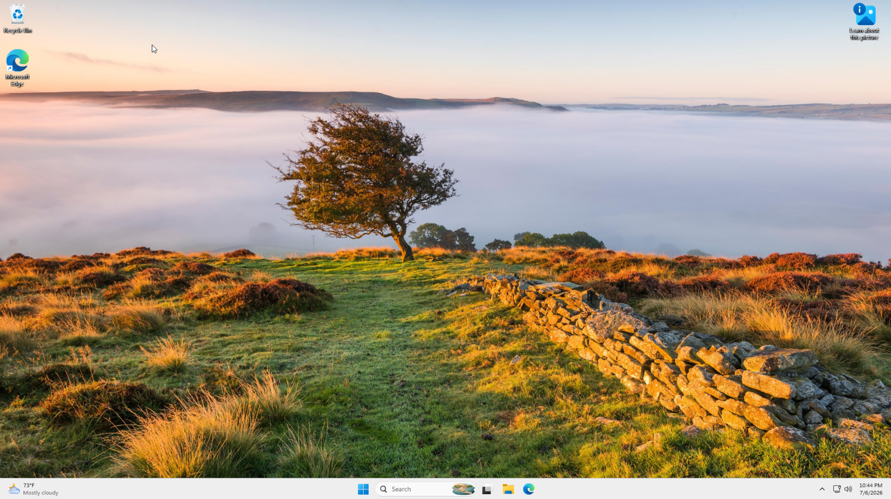
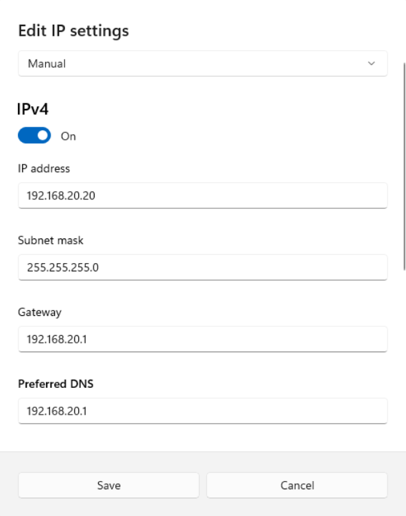
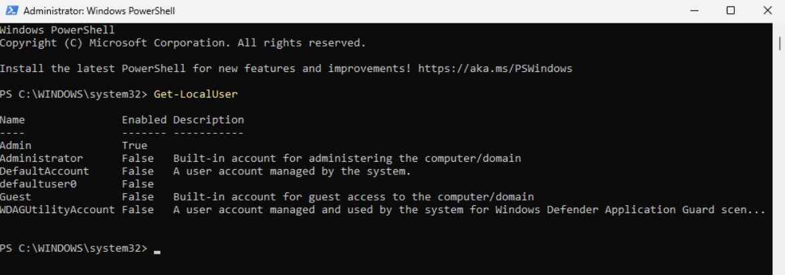
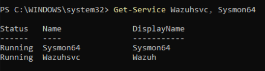
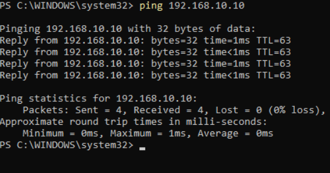
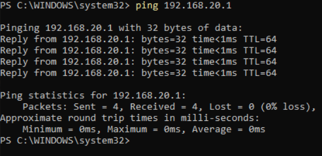

# Windows 11 Setup

This document covers the installation and configuration of the Windows 11 virtual machine in the SOC homelab. Windows 11 serves as the target endpoint in the lab and is monitored by a Wazuh agent.

## VM Specifications

| Property | Value |
|---|---|
| Operating System | Windows 11 Home |
| RAM | 4GB |
| CPUs | 2 |
| Storage | 64GB |
| Network Adapter | 1 (SOC-Lab-Windows segment) |
| IP Address | 192.168.20.20 |
| Gateway | 192.168.20.1 (pfSense) |
| Role | Target Endpoint |

## Installation

Windows 11 Home was installed as a virtual machine in VMware Workstation Pro using the official Windows 11 ISO, obtained through the Microsoft Media Creation Tool at [the official Microsoft website](https://www.microsoft.com/software-download/windows11). See [VMware Setup](vmware-setup.md) for VM hardware allocation.

During installation, a local account was created without linking to a Microsoft account, keeping the environment self-contained and independent of any external services.

The screenshot below shows the Windows 11 desktop, confirming the VM is installed and operational.



## Network Configuration

A static IP address was manually assigned to the Windows 11 VM to ensure consistent addressing on the SOC-Lab-Windows segment.

### Static IP Assignment

| Property | Value |
|---|---|
| IP Address | 192.168.20.20 |
| Subnet Mask | 255.255.255.0 |
| Gateway | 192.168.20.1 |
| DNS | 192.168.20.1 (pfSense) |

The static IP address was assigned by navigating to:
```
Settings > Network & Internet > Ethernet > Edit (next to IP Assignment) > Manual > IPv4
```

The screenshot below shows the Windows network settings confirming the static IP, gateway, and DNS have been correctly assigned to the Windows 11 VM.



## User Accounts

A single local administrator account was created on the Windows 11 VM, with no Microsoft account linked.

| Account Type | Purpose |
|---|---|
| Administrator (Local) | Sole account used to operate and configure the endpoint |

The account was confirmed using the following PowerShell command:
```powershell
Get-LocalUser
```

The screenshot below shows the account listed via PowerShell, confirming successful creation.



## Security Monitoring Stack

The Windows 11 VM has two security monitoring components installed that work together to collect and forward endpoint telemetry to the Wazuh Manager on the Ubuntu Server VM.

### Wazuh Agent

The Wazuh agent is installed and configured to forward Windows Event Logs and Sysmon logs to the Wazuh Manager at 192.168.10.10. Full agent deployment steps are documented in [Wazuh Setup](wazuh-setup.md).

### Sysmon

Sysmon is installed to significantly enhance the quality and detail of endpoint logs collected by the Wazuh agent. Full installation and configuration steps are documented in [Sysmon Setup](sysmon-setup.md).

Both services were confirmed running using the following PowerShell command:
```powershell
Get-Service WazuhSvc, Sysmon64
```

The screenshot below shows both services running and confirmed active on the Windows 11 VM.



## Connectivity Verification

After static IP assignment, connectivity was verified across the two most critical communication paths for the Windows 11 endpoint.

### Windows 11 to Ubuntu Server (Wazuh SIEM)
Confirms the Wazuh agent can reach the Wazuh Manager across segments. If this fails, no logs are forwarded and no alerts fire.
```powershell
ping 192.168.10.10
```



### Windows 11 to pfSense Gateway
Confirms the target endpoint can reach its gateway. If this fails, the workstation has no internet access.
```powershell
ping 192.168.20.1
```



## Configuration Notes

- Static IP addressing is configured locally on the OS rather than through DHCP reservations on pfSense
- DNS resolution routes through the pfSense gateway, which forwards queries to 8.8.8.8 and 1.1.1.1
- Internet access is available through pfSense via VMware NAT for updates and tool downloads as needed
- Full Wazuh agent deployment is covered in [Wazuh Setup](wazuh-setup.md)
- Full Sysmon installation and configuration is covered in [Sysmon Setup](sysmon-setup.md)
