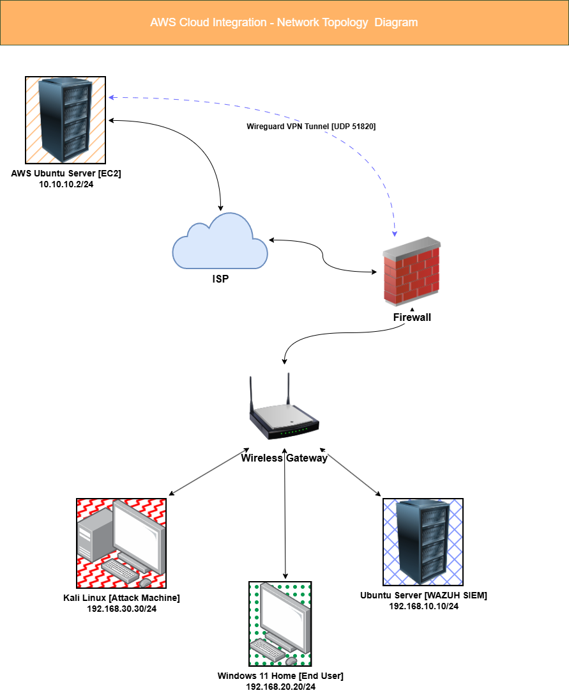

# AWS Cloud Integration

This project extends the core lab's Wazuh SIEM to monitor a cloud-hosted endpoint. An AWS EC2 instance is connected back to the home network over an encrypted WireGuard tunnel through pfSense, monitored by a Wazuh agent, and used as the target of a simulated attack from Kali Linux. The result proves the home SIEM can detect and attribute attacker activity against cloud infrastructure the same way it already detects activity on-prem.

## Prerequisites

This project builds on top of the core lab and does not stand on its own. Before starting, make sure the [Core Lab](../../core-lab/README.md) is fully built and operational.

## Getting Started

To build this project, start with the [Setup Guide Index](setup/README.md), which lists every component in the order it should be installed. For the reasoning behind this project's design before diving into setup, start with the [Architecture Overview](architecture/aws-cloud-integration-architecture-overview.md) instead.

## Network Diagram



This project added a new WireGuard tunnel interface, WG_AWS, to the existing pfSense VM, bridging a cloud-hosted EC2 instance back to the home network's SIEM subnet. Full rationale for this design is documented in the [Architecture Overview](architecture/aws-cloud-integration-architecture-overview.md).

## Execution and Results

To see the project built end-to-end, with screenshots proving the tunnel, agent, and detection all work, see [Execution](execution.md).

## Quick Links

- [Architecture Overview](architecture/aws-cloud-integration-architecture-overview.md) - technology rationale, network diagram, and design decisions
- [Setup Guide Index](setup/README.md) - recommended install order and a summary of every component's purpose
- [Execution](execution.md) - proof of work, from cloud infrastructure through simulated attack detection

## Repository Structure

```
projects/aws-cloud-integration/
├── README.md
├── execution.md
├── architecture/
│   ├── README.md
│   └── aws-cloud-integration-architecture-overview.md
├── setup/
│   ├── README.md
│   ├── aws-ec2-setup.md
│   ├── wireguard-tunnel-setup.md
│   └── wazuh-agent-setup.md
└── images/
    └── (screenshots and diagrams referenced throughout the documentation)
```

- **architecture/** - explains why this project is designed the way it is: technology rationale, network segmentation, and tunnel design
- **setup/** - step-by-step installation and configuration guides for every component in this project
- **images/** - all screenshots and diagrams referenced across this project's documentation
