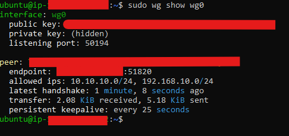
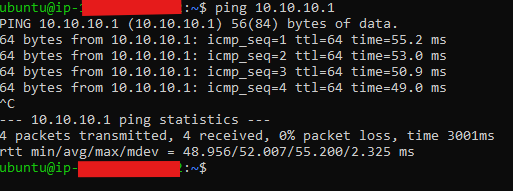
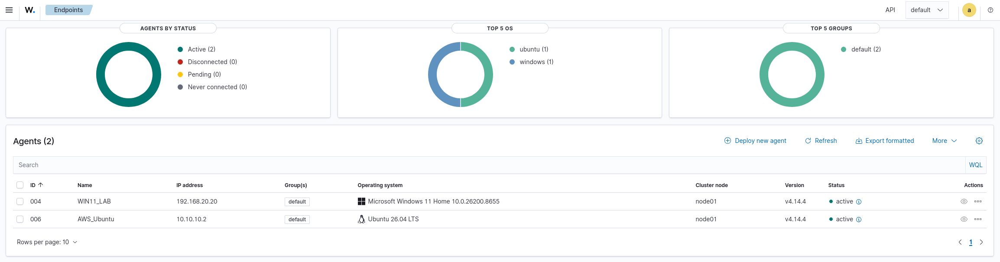
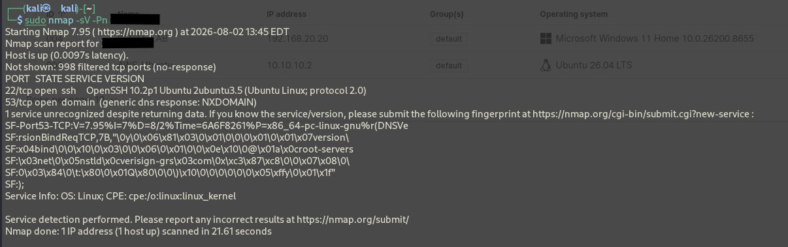
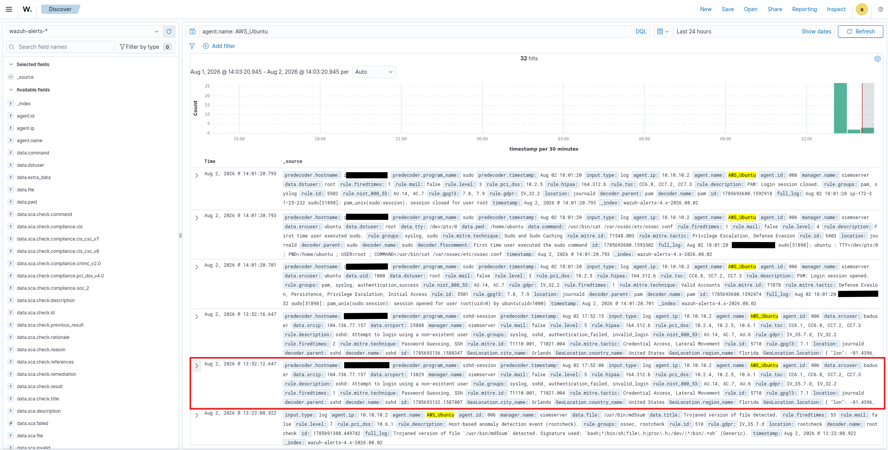
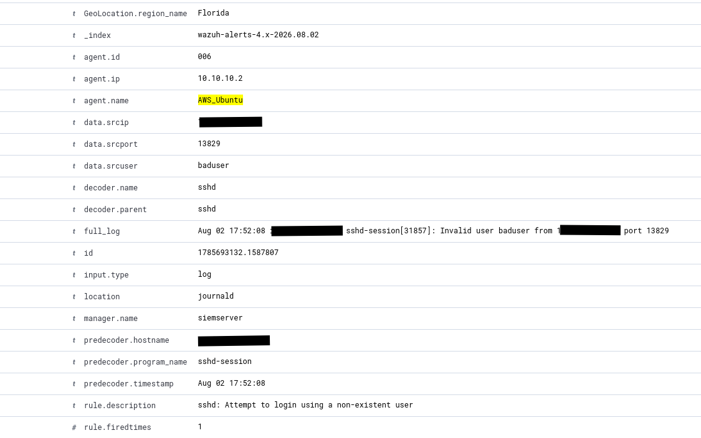

# Execution

This document walks through how the AWS Cloud Integration project was built and proven to work, from standing up the cloud infrastructure to watching the home Wazuh manager catch a simulated attack against it. For full step-by-step instructions, see the [Setup](setup/README.md) guides. For the reasoning behind each design decision, see the [Architecture Overview](architecture/aws-cloud-integration-architecture-overview.md).

The goal of this project was to extend the home SOC lab's Wazuh SIEM out to a cloud-hosted endpoint, and then prove that the SIEM could detect attacker activity against that endpoint the same way it already detects activity on-prem.

## Standing Up the Cloud Target

The first step was getting an EC2 instance up and running under a dedicated, least-privilege IAM user rather than the AWS root account. Once the instance was launched, its security group was locked down so that SSH was only reachable from the operator's home IP, keeping the instance's exposure to the open internet as small as possible from the start.

## Building a Private Path Back Home

With the instance running, the next step was giving it a way to reach the home network without opening up the Wazuh manager to the internet. A WireGuard tunnel was built between pfSense and the EC2 instance, so that all SIEM-related traffic between the cloud and the home lab travels over an encrypted, authenticated connection. Once both sides were configured, the tunnel came up, and the two ends could reach each other directly, confirmed here with a successful handshake and a ping across the tunnel to the home network.

## Getting the Cloud Endpoint Talking to Wazuh

With the tunnel in place, a Wazuh agent was installed on the EC2 instance and pointed at the home Wazuh manager. The agent registered successfully and showed up active in the Wazuh dashboard right alongside the lab's existing on-prem devices, which meant the manager was now watching a cloud endpoint through the exact same pipeline it uses for everything else in the lab.

## Simulating an Attack

The last piece was proving all of this actually catches something. From Kali Linux, an Nmap scan was run against the EC2 instance's public IP to simulate reconnaissance, followed by repeated failed SSH login attempts to simulate a brute-force attempt.

Back on the Wazuh dashboard, the failed login attempts showed up as a detected brute-force alert, tied directly to the EC2 agent rather than any on-prem device.

## Result

The home Wazuh manager successfully detected and attributed simulated attacker activity against a cloud-hosted endpoint, over an encrypted tunnel, without ever exposing the manager itself to the internet. The lab's SIEM now extends beyond the home network to monitor cloud infrastructure using the same detection pipeline it uses on-prem.
