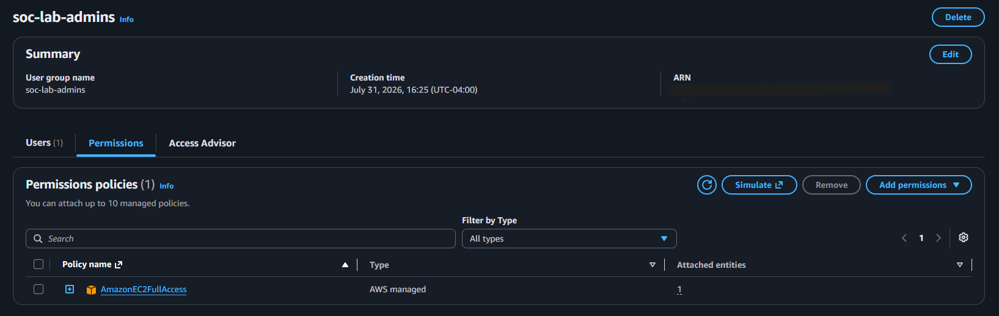
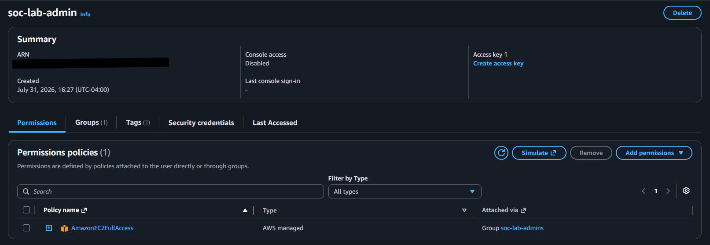
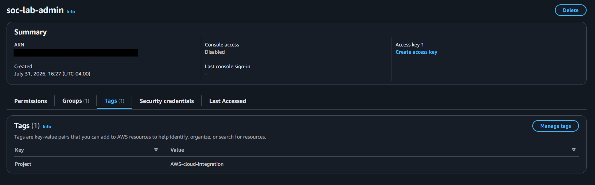
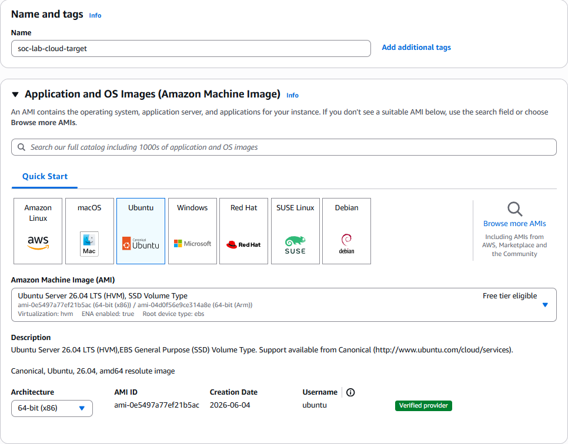
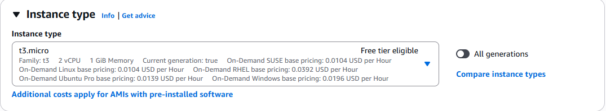
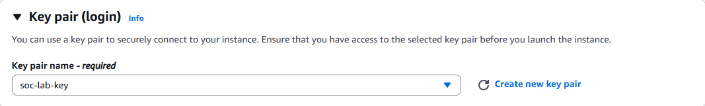
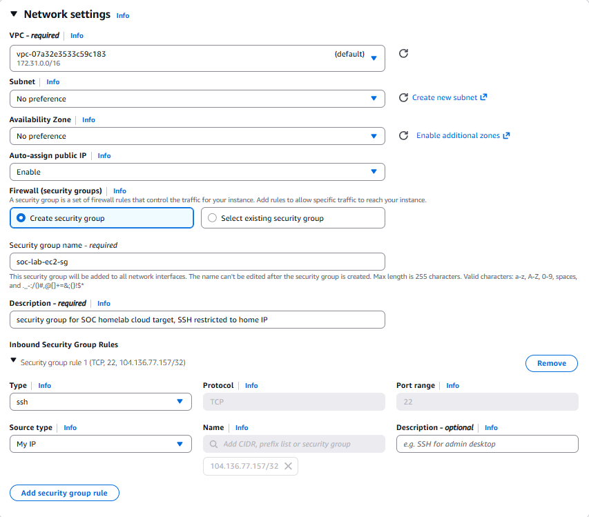
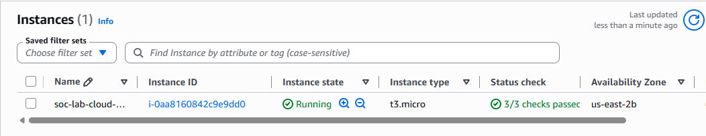
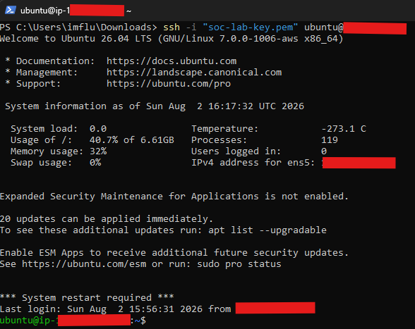

# AWS EC2 Setup

This document covers the setup and configuration of the AWS account resources and EC2 instance used as the cloud target in this project. The EC2 instance serves as a cloud hosted endpoint monitored by the home Wazuh manager over a WireGuard tunnel, and as the target of a simulated attack from the Kali Linux VM. WireGuard tunnel configuration is documented separately in [WireGuard Tunnel Setup](wireguard-tunnel-setup.md), and Wazuh agent installation is documented separately in [Wazuh Agent Setup](wazuh-agent-setup.md).

## Instance Specifications

| Property | Value |
|---|---|
| Operating System | Ubuntu Server 26.04 LTS |
| Instance Type | t3.micro (Free Tier) |
| vCPUs | 2 |
| Memory | 1 GiB |
| Tunnel IP Address | 10.10.10.2/24 |
| Public IPv4 Address | Dynamic, assigned by AWS |
| Security Group | soc-lab-ec2-sg |
| Role | Cloud target, Wazuh agent endpoint |

## IAM Setup

Rather than using the AWS root account or a broadly privileged user for this project, a dedicated IAM group and user were created first, following the principle of least privilege.

An IAM group, `soc-lab-admins`, was created with the `AmazonEC2FullAccess` policy attached, rather than `AdministratorAccess`. This project's scope only requires launching, managing, and terminating EC2 resources, so broader account-level access was unnecessary and would have increased the blast radius of these credentials if they were ever exposed.

The screenshot below shows the group with its attached policy.



An IAM user, `soc-lab-admin`, was created and added to this group rather than having a policy attached directly, so future users or automation accounts could be added to the group without re-attaching policies individually. Console access was enabled at creation time with a password set immediately.



Tags were added to the user for identification and documentation purposes.

| Key | Value |
|---|---|
| Project | AWS-cloud-integration |
| Purpose | soc-lab-ec2-management |
| Environment | lab |



All subsequent AWS console work for this project was performed while logged in as `soc-lab-admin`, not the root account.

## EC2 Instance Launch

The EC2 instance was launched from the AWS Management Console using the following configuration:

- AMI: Ubuntu Server 26.04 LTS, confirmed Free Tier eligible
- Instance type: t3.micro, confirmed Free Tier eligible
- Key pair: newly generated, `soc-lab-key.pem`, downloaded and stored locally, never committed to this repository







## Network Configuration

The instance's security group, `soc-lab-ec2-sg`, was configured before launch to restrict inbound access rather than leaving default rules in place.

| Property | Value |
|---|---|
| Auto-assign Public IP | Enabled |
| Inbound Rule | SSH (TCP 22), source restricted to operator's home IP |
| Outbound Rule | Default, all traffic allowed |

The default 0.0.0.0/0 inbound rule was removed, and a single rule allowing SSH from the operator's home IP only was added in its place. All other inbound access, including the traffic that reaches the Wazuh agent over the WireGuard tunnel, is handled separately by the tunnel itself rather than by additional security group rules, since tunnel traffic is encrypted and delivered through pfSense rather than arriving directly at the instance's public interface.



Once the instance reached a running state, this was confirmed in the console.



## Connectivity Verification

SSH access was verified from the operator's local machine using the downloaded key pair.

### Linux/macOS

```bash
chmod 400 soc-lab-key.pem
ssh -i soc-lab-key.pem ubuntu@<ec2-public-ip>
```

### Windows (PowerShell)

```powershell
icacls.exe "soc-lab-key.pem" /reset
icacls.exe "soc-lab-key.pem" /grant:r "$($env:USERNAME):(R)"
icacls.exe "soc-lab-key.pem" /inheritance:r
ssh -i "soc-lab-key.pem" ubuntu@<ec2-public-ip>
```

The screenshot below confirms a successful SSH connection and shell prompt.



## Configuration Notes

- The IAM user for this project was granted console sign-in access at creation time; if this is missed, it can be added afterward from the user's Security Credentials tab
- The instance's public IP is dynamic and changes whenever the instance is stopped and started, which requires updating the WireGuard peer endpoint on the EC2 side; see [WireGuard Tunnel Setup](wireguard-tunnel-setup.md)
- SSH access remains restricted to the operator's home IP; all SIEM-related traffic reaches this instance through the encrypted WireGuard tunnel rather than through an open port
