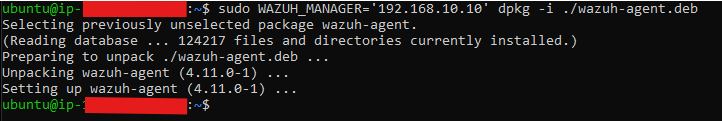
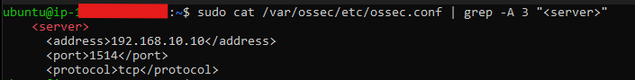
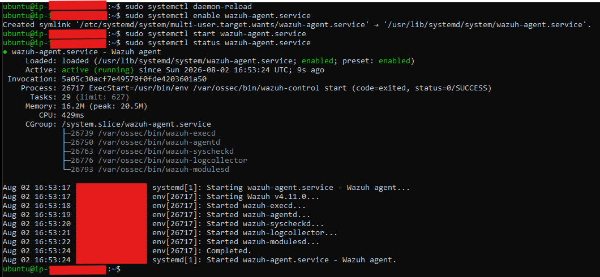

# Wazuh Agent Setup

This document covers the installation and registration of the Wazuh agent on the AWS EC2 instance. The agent forwards logs to the home Wazuh manager over the WireGuard tunnel documented in [WireGuard Tunnel Setup](wireguard-tunnel-setup.md), allowing the manager to monitor this cloud-hosted endpoint the same way it monitors on-prem devices in the lab.

## Agent Specifications

| Property | Value |
|---|---|
| Agent Name | AWS_Ubuntu |
| Agent Version | 4.14.4 |
| Manager Address | 192.168.10.10 |
| Manager Port | TCP 1514 (via WireGuard tunnel) |
| Host | EC2 instance, 10.10.10.2 (tunnel address) |

## Installation

The agent package was downloaded and installed with the manager address and agent name set at install time, so the agent registers under a recognizable name rather than defaulting to the instance's IP address.

```bash
curl -o wazuh-agent.deb https://packages.wazuh.com/4.x/apt/pool/main/w/wazuh-agent/wazuh-agent_4.14.4-1_amd64.deb
sudo WAZUH_MANAGER='192.168.10.10' WAZUH_AGENT_NAME='AWS_Ubuntu' dpkg -i ./wazuh-agent.deb
```



The manager address was confirmed in the agent's configuration file.

```bash
sudo cat /var/ossec/etc/ossec.conf | grep -A 3 "<server>"
```



The agent was enabled and started.

```bash
sudo systemctl daemon-reload
sudo systemctl enable wazuh-agent
sudo systemctl start wazuh-agent
sudo systemctl status wazuh-agent
```



## Registration Verification

Once started, the agent was confirmed active on the manager side, both from the command line and the Wazuh dashboard.

```bash
sudo /var/ossec/bin/agent_control -l
```


## Configuration Notes

- The agent name is set at install time using the `WAZUH_AGENT_NAME` environment variable; setting it here avoids needing to rename the agent from the manager side afterward
- Log collection for authentication events relies on `/var/log/auth.log`, which is included in the agent's default configuration; this is what allows the SSH activity covered in [Execution](../execution.md) to reach the manager
- Agent and manager versions should be kept aligned; this agent was installed at version 4.14.4 to match the intended manager version for this project
