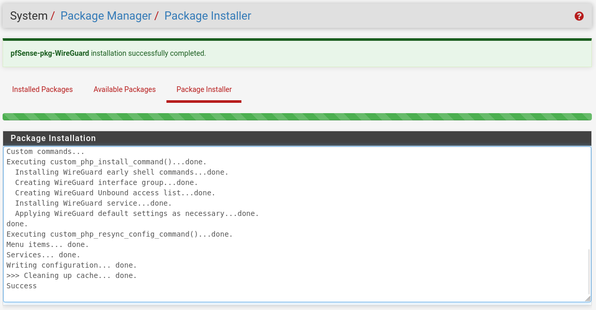
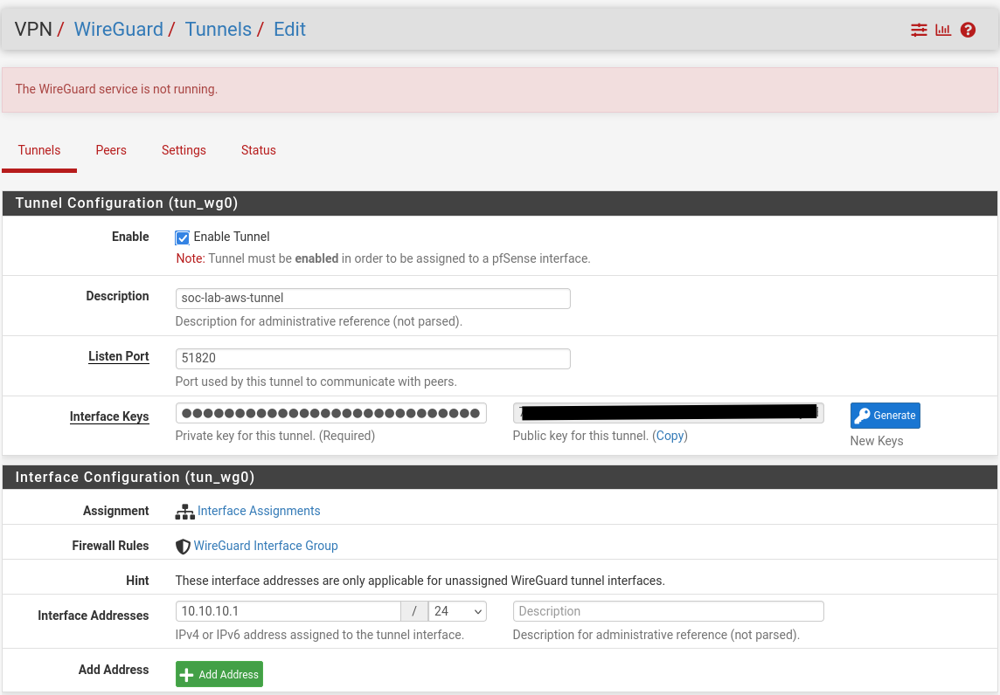
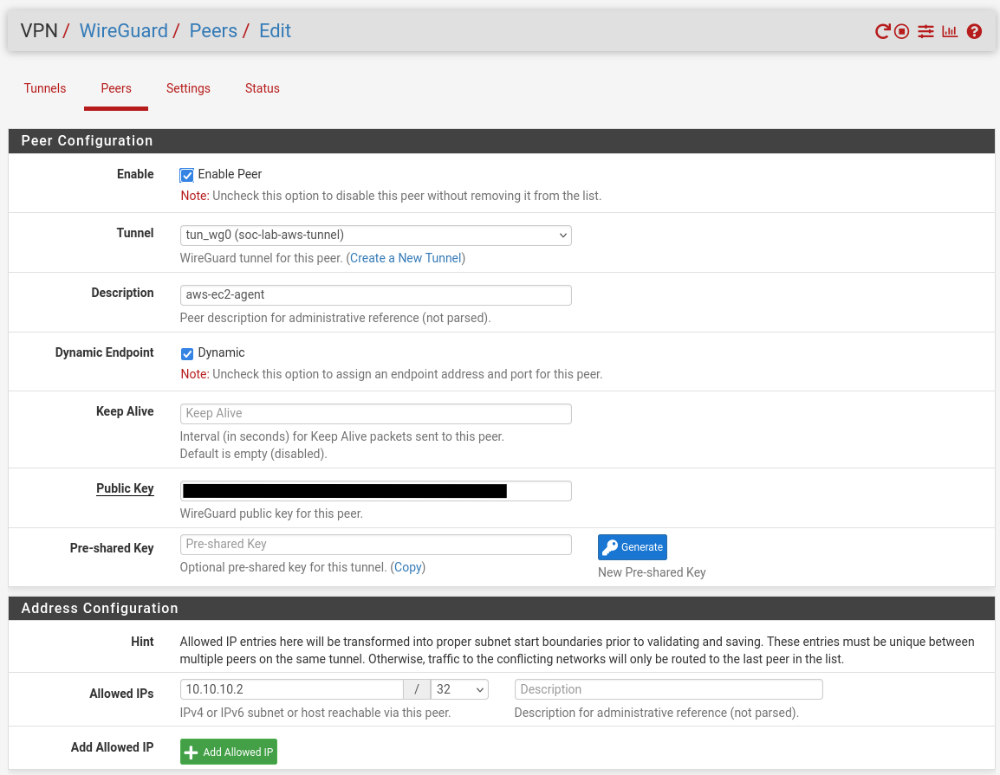
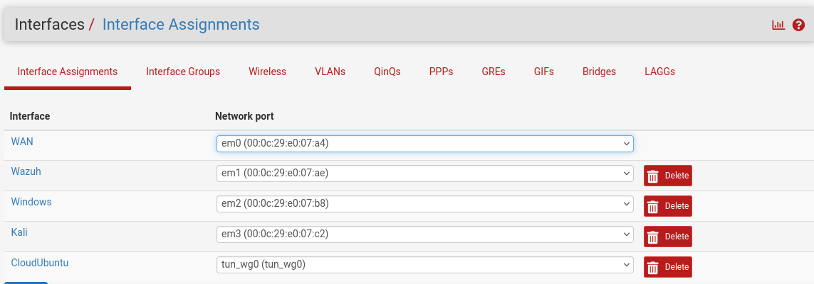
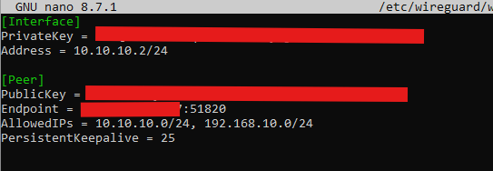
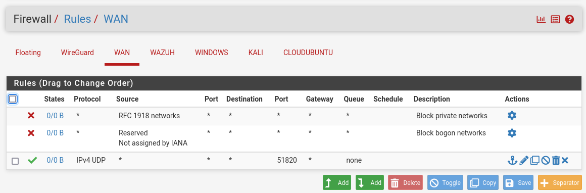
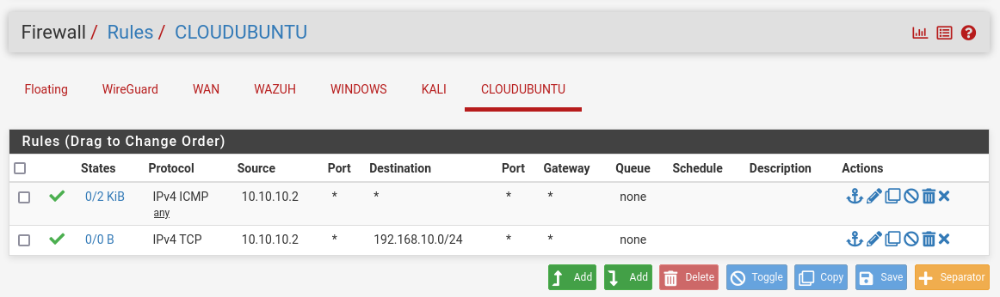
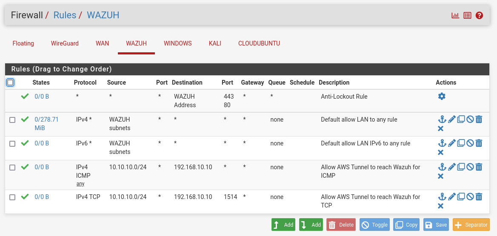

# WireGuard Tunnel Setup

This document covers the setup and configuration of the WireGuard site-to-site VPN tunnel connecting the home lab to the AWS EC2 instance. pfSense serves as the tunnel server, and the EC2 instance serves as the tunnel client, initiating the connection outward toward pfSense's public IP. This tunnel is what allows the Wazuh agent on EC2, covered in [Wazuh Agent Setup](wazuh-agent-setup.md), to reach the home Wazuh manager without exposing the manager directly to the internet.

## Tunnel Specifications

| Property | Value |
|---|---|
| Protocol | WireGuard |
| Topology | Site to site |
| Listen Port | UDP 51820 |
| Tunnel Subnet | 10.10.10.0/24 |
| pfSense Tunnel Address | 10.10.10.1 |
| EC2 Tunnel Address | 10.10.10.2 |
| pfSense Assigned Interface | WG_AWS (CLOUDUBUNTU) |
| Endpoint Mode | Dynamic (EC2 initiates, pfSense accepts) |

## VMware WAN Adapter Requirement

Before the tunnel can accept inbound connections from the internet, pfSense's WAN network adapter in VMware must be set to Bridged mode rather than NAT mode. In NAT mode, VMware itself performs an additional layer of address translation in front of pfSense, meaning pfSense's WAN interface never receives a real address on the home network and cannot be reached from outside. Bridged mode allows pfSense's WAN adapter to obtain an address directly from the home network's router, placing it in the position needed to act as an internet facing VPN endpoint. This change was made in VM Settings, Network Adapter, with Bridged selected and Replicate Physical Network Connection State enabled.

Because the home network sits behind a consumer router (eero) performing its own NAT, port forwarding for UDP 51820 was also configured on the router, pointing to pfSense's bridged WAN IP address, so that inbound WireGuard traffic reaches pfSense rather than being dropped at the router.

## pfSense Setup

### Package Installation

The WireGuard package was installed through System, Package Manager, Available Packages.



### Tunnel Configuration

A new tunnel was created under VPN, WireGuard, Tunnels, with a listen port of 51820 and an interface address of 10.10.10.1/24. Interface keys were generated automatically by pfSense.



### Peer Configuration

A peer was added representing the EC2 instance, with Allowed IPs set to 10.10.10.2/32 and Dynamic Endpoint enabled, since EC2 does not have a fixed IP from pfSense's perspective and initiates the connection itself.



### Interface Assignment

The tunnel was assigned as a pfSense interface, named CLOUDUBUNTU, with a static IPv4 address of 10.10.10.1/24 set directly on the interface.



## EC2 Setup

WireGuard was installed on the EC2 instance, and a keypair was generated locally.

```bash
sudo apt update
sudo apt install wireguard -y
wg genkey | sudo tee /etc/wireguard/privatekey | wg pubkey | sudo tee /etc/wireguard/publickey
```

The EC2 public key was copied into pfSense's peer configuration, and pfSense's tunnel public key was used to build the EC2 side configuration file.

```bash
sudo nano /etc/wireguard/wg0.conf
```

```
[Interface]
PrivateKey = <EC2 private key>
Address = 10.10.10.2/24

[Peer]
PublicKey = <pfSense tunnel public key>
Endpoint = <pfSense current public IP>:51820
AllowedIPs = 10.10.10.0/24, 192.168.10.0/24
PersistentKeepalive = 25
```

The `AllowedIPs` value includes both the tunnel subnet and the home Wazuh manager's subnet. This is required for two reasons: it controls which destination networks EC2 will route through the tunnel interface at all, and it defines what traffic pfSense will accept from this peer. Without the manager's subnet included here, traffic destined for the Wazuh manager is never sent into the tunnel in the first place.



The tunnel was brought up and enabled to start automatically on boot.

```bash
sudo wg-quick up wg0
sudo systemctl enable wg-quick@wg0
```

## Firewall Configuration

pfSense evaluates firewall rules per interface, so traffic between the tunnel and the SIEM subnet requires rules on both the tunnel interface and the SIEM interface, in addition to the rule allowing the tunnel itself to establish on WAN.

### WAN Interface

Allows the WireGuard handshake traffic to reach pfSense from the internet.

| Protocol | Source | Destination | Port |
|---|---|---|---|
| UDP | Any | WAN address | 51820 |



### CLOUDUBUNTU Interface (Tunnel)

Allows traffic from the EC2 tunnel address to leave toward the SIEM subnet.

| Protocol | Source | Destination | Port |
|---|---|---|---|
| ICMP | 10.10.10.2 | Any | N/A |
| TCP | 10.10.10.2 | 192.168.10.0/24 | 1514 |



### WAZUH Interface (SIEM Subnet)

Allows traffic arriving from the tunnel subnet to reach the Wazuh manager. Without this rule, the SIEM interface's default rules only permit traffic sourced from its own local subnet, and traffic arriving from the tunnel is silently dropped.

| Protocol | Source | Destination | Port |
|---|---|---|---|
| ICMP | 10.10.10.0/24 | Any | N/A |
| TCP | 10.10.10.0/24 | 192.168.10.10 | 1514 |



## Connectivity Verification

Once both sides were configured, the tunnel handshake was confirmed from the EC2 instance.

```bash
sudo wg show wg0
```


Connectivity across the tunnel was then verified by pinging both pfSense's tunnel address and the Wazuh manager directly, confirming that routing between the tunnel and the SIEM subnet works end to end.

```bash
ping 10.10.10.1
ping 192.168.10.10
```


## Configuration Notes

- EC2's public IP is dynamic and changes when the instance is stopped and started; the `Endpoint` line in `/etc/wireguard/wg0.conf` must be updated to pfSense's current public IP if it changes, and the tunnel brought back up with `sudo wg-quick down wg0 && sudo wg-quick up wg0`
- pfSense's own public IP can also change if the home network's ISP assigns a new address; a Dynamic DNS hostname is a recommended future improvement so the EC2 endpoint does not need to be updated manually
- The WireGuard service on pfSense must be enabled under VPN, WireGuard, Settings before the tunnel interface becomes available for assignment
- `AllowedIPs` on the EC2 side must include every subnet EC2 needs to reach through the tunnel, not just the tunnel subnet itself
