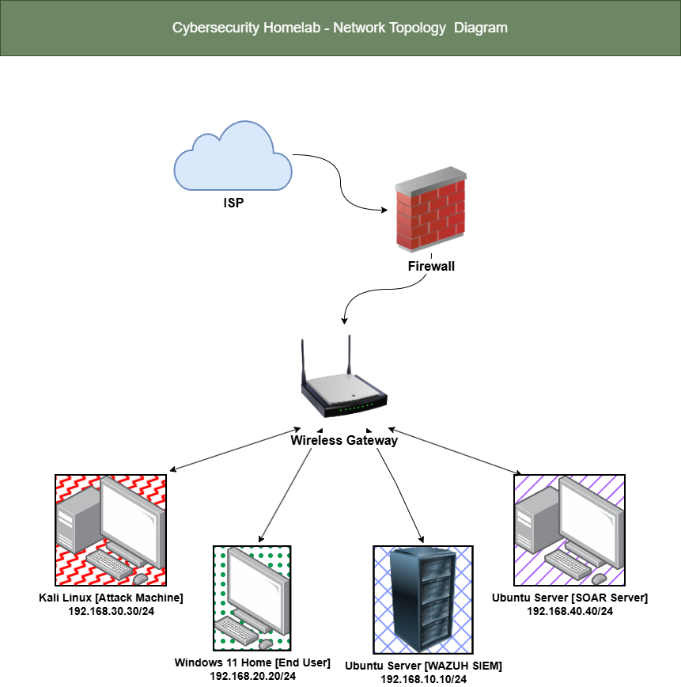
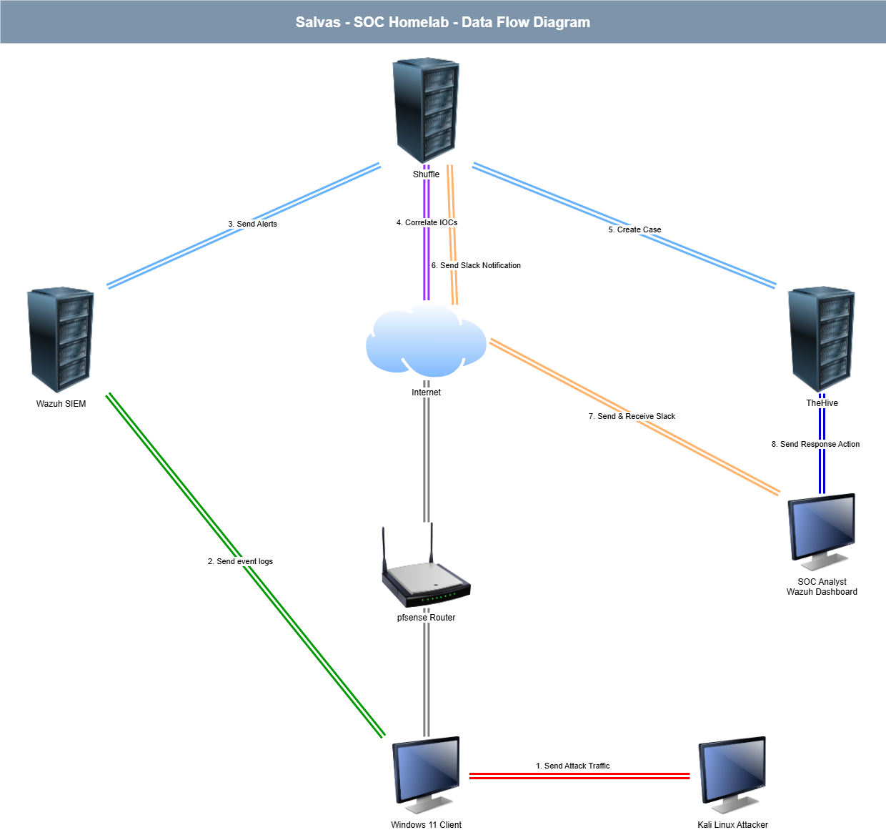

# SOAR Automation

This project adds security orchestration, automation, and response (SOAR) capabilities on top of the core lab. It automates the SOC analyst's response to Wazuh alerts: enriching them with threat intelligence, creating a tracked case, and notifying the analyst, without manual intervention. The stack consists of a dedicated Ubuntu Server VM running Shuffle for workflow automation and TheHive for case management, connected to the core lab's existing Wazuh SIEM.

## Prerequisites

This project builds on top of the core lab and does not stand on its own. Before starting, make sure the [Core Lab](../../core-lab/README.md) is fully built and operational, specifically pfSense, the Wazuh SIEM, and the Windows 11 endpoint, since this project's Wazuh integration depends on the core lab's Wazuh Manager already being installed and running.

## Network Diagram



This project added a new dedicated network segment, SOC-Lab-SOAR, to the existing pfSense VM to keep the SOAR stack isolated from the core lab's monitored segments. Full rationale for this design is documented in the [Architecture Overview](architecture/soar-architecture-overview.md).

## Data Flow Diagram



This diagram shows how a single Wazuh alert moves through the automation pipeline, from webhook trigger through IOC enrichment, case creation, and Slack notification. Full technical detail is documented in [Shuffle Setup](setup/shuffle-setup.md).

## Repository Structure

```
projects/soar-automation/
├── README.md
├── architecture/
│   ├── README.md
│   └── soar-architecture-overview.md
├── setup/
│   ├── README.md
│   ├── ubuntu-soar-setup.md
│   ├── thehive-setup.md
│   └── shuffle-setup.md
└── images/
    └── (screenshots and diagrams referenced throughout the documentation)
```

- **architecture/** - explains why this project is designed the way it is: technology rationale, network segmentation, and the data flow pipeline
- **setup/** - step by step installation and configuration guides for every component in this project
- **images/** - all screenshots and diagrams referenced across this project's documentation

## Quick Links

- [Architecture Overview](architecture/soar-architecture-overview.md) - technology rationale, network diagram, and data flow diagram
- [Setup Guide Index](setup/README.md) - recommended install order and a summary of every component's purpose

## Getting Started

Before starting this project, make sure the core lab is fully built, this project depends on the existing pfSense router and the Wazuh SIEM. To build this project, start with the [Setup Guide Index](setup/README.md), which lists every component in the order it should be installed. For the reasoning behind this project's design before diving into setup, start with the [Architecture Overview](architecture/soar-architecture-overview.md) instead.
