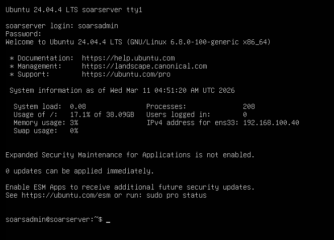
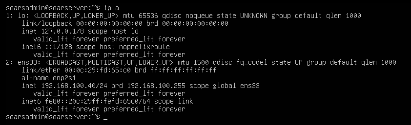
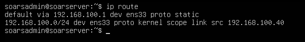
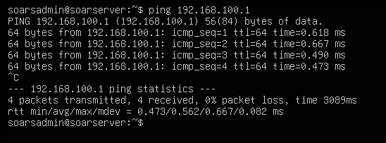

# Ubuntu Server Setup (SOAR)

This document covers the installation and configuration of the Ubuntu Server virtual machine that hosts the SOAR stack in this project. This VM runs Shuffle for automated response workflows and TheHive for case management. Full installation and configuration details for each tool are documented separately in [Shuffle Setup](shuffle-setup.md) and [TheHive Setup](thehive-setup.md), this document covers the underlying operating system only.

## VM Specifications

| Property | Value |
|---|---|
| Operating System | Ubuntu Server 24.04 LTS (headless) |
| RAM | 20GB |
| CPUs | 4 |
| Storage | 80GB |
| Network Adapter | 1 (SOC-Lab-SOAR segment) |
| IP Address | 192.168.40.40 |
| Gateway | 192.168.40.1 (pfSense) |
| Role | SOAR Server (Shuffle / TheHive) |

## Installation

Ubuntu Server 24.04 LTS was installed as a virtual machine in VMware Workstation Pro using the official Ubuntu Server ISO, available at [the official Ubuntu Server download](https://ubuntu.com/download/server). This VM connects to pfSense through a new dedicated LAN segment, SOC-Lab-SOAR, on pfSense interface em5.

No desktop environment was installed, Ubuntu Server runs headless via terminal only, which reduces resource usage. During installation, the static IP, gateway, and DNS were configured directly through the installer's network configuration screen rather than editing netplan after the fact.

The screenshot below confirms the Ubuntu Server VM is fully installed and operational.



## Network Configuration

A static IP address was assigned to the Ubuntu Server VM during installation to ensure consistent addressing on the SOC-Lab-SOAR segment.

### Static IP Assignment

| Property | Value |
|---|---|
| IP Address | 192.168.40.40 |
| Subnet Mask | 255.255.255.0 |
| Gateway | 192.168.40.1 |
| DNS | 192.168.40.1 (pfSense) |

The following configuration was applied during installation:

| Field | Value |
|---|---|
| Subnet | 192.168.40.0/24 |
| Address | 192.168.40.40 |
| Gateway | 192.168.40.1 |
| Name servers | 192.168.40.1 |
| Search domains | leave blank |

The screenshot below shows the output of `ip a` confirming the static IP address is active on the Ubuntu Server VM.



The screenshot below shows the output of `ip route` confirming the default gateway is correctly set to 192.168.40.1.



## System Update

After installation, the system package list and all installed packages were updated to ensure the latest libraries and security patches are in place before tool installation.
```bash
sudo apt update && sudo apt upgrade -y
```

## Connectivity Verification

After static IP assignment, connectivity was verified from the Ubuntu Server VM to the pfSense gateway.
```bash
ping 192.168.40.1
```

This confirms the SOAR server can reach the gateway. If this fails, no outbound traffic, including Slack notifications and IOC enrichment queries, will succeed once those integrations are configured.



## Configuration Notes

- Ubuntu Server runs headless with no desktop environment installed, reducing RAM and CPU overhead and leaving more resources available for the SOAR stack
- 20GB RAM and 4 CPUs were allocated to meet the concurrent resource requirements of running TheHive and Shuffle on the same VM
- 80GB storage was allocated to accommodate TheHive case data and Docker container storage accumulation over time
- Docker installation is covered in the [Shuffle Setup](shuffle-setup.md) document, since Docker exists specifically to support running Shuffle
- Full Shuffle installation and configuration is covered in [Shuffle Setup](shuffle-setup.md)
- Full TheHive installation and configuration is covered in [TheHive Setup](thehive-setup.md)
- Internet access through pfSense is required for system updates, Docker installation, Slack notification delivery, and IOC enrichment queries once configured
- The local username on this VM is `soarsadmin`
