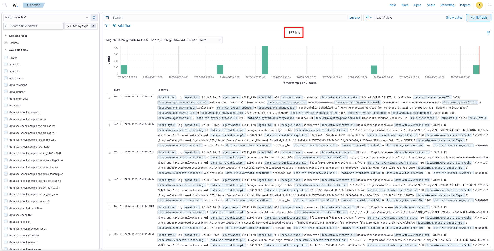
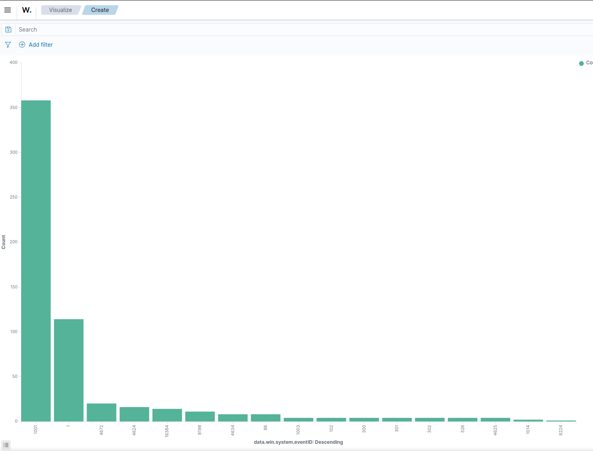
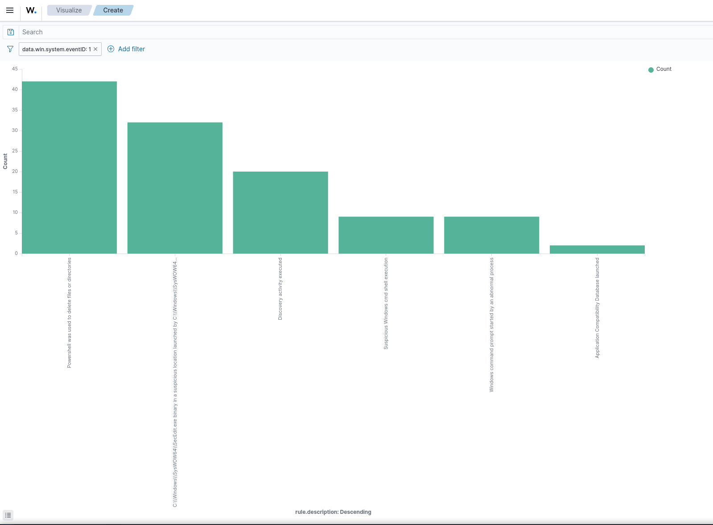
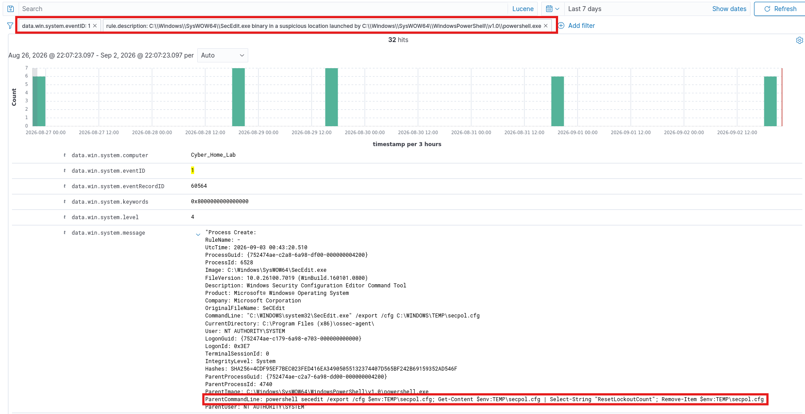
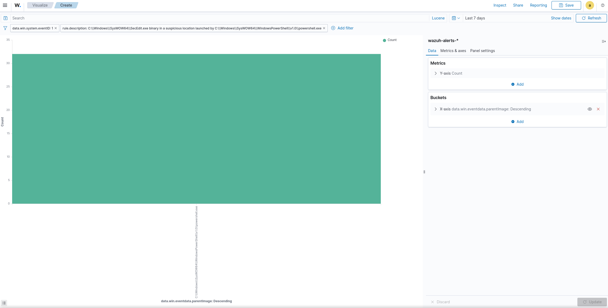

# Investigation 02: Living off the Land

## Goal

Generate and investigate Windows telemetry associated with a **Living-off-the-Land (LotL)** attack on the Windows 11 lab target. The investigation focuses on identifying legitimate Windows utilities being used in suspicious ways, separating genuine attack activity from security-tool false positives, and reconstructing the process chain in Wazuh.

The primary investigative question was:

> **Can the Windows 11 endpoint telemetry distinguish legitimate administrative/security activity from suspicious use of native Windows binaries?**

## Prerequisites

Ensure that the Core-Lab is set up and configured as instructed in [core-lab setup](https://github.com/Salvadel/soc-homelab-environment/blob/main/core-lab/README.md).

See [living-off-the-land](./README.md) for how the activity is reproduced.

## Investigation

The starting point was the Discover view in Wazuh, which showed **977 hits** over the last seven days with no filtering applied yet. The event volume contained a mixture of Windows security events, Wazuh/SCA activity, and process telemetry, making direct review of every alert impractical.



**1. Establishing the initial scope**

The first step was to determine which Windows Event IDs were present in the dataset. A visualization was created using `data.win.system.eventID` as the X-axis and event count as the metric.

The most common events were Event ID **1001** and Event ID **1**, followed by smaller numbers of authentication, privilege, service, and other Windows events.



Because a Living-off-the-Land investigation is primarily concerned with the execution of native Windows programs, **Event ID 1 (Sysmon Process Create)** was selected as the main investigative starting point. Process creation provides the executable image, command line, user, parent process, and process identifiers needed to reconstruct execution chains.

**2. Narrowing to process creation**

The Discover search was filtered to:

```text
data.win.system.eventID: 1
```

This removed the large amount of unrelated authentication, service, and system telemetry and left a much smaller process-execution-focused dataset.

The remaining events were then reviewed through fields including:

- `data.win.eventdata.image`
- `data.win.eventdata.commandLine`
- `data.win.eventdata.parentImage`
- `data.win.eventdata.parentCommandLine`
- `data.win.eventdata.processId`
- `data.win.eventdata.parentProcessId`
- `data.win.eventdata.user`
- `timestamp`

**3. Reviewing process-related rule descriptions**

The `rule.description` field was used to identify which types of process activity Wazuh was flagging.

The resulting distribution included descriptions associated with PowerShell file deletion, suspicious `SecEdit.exe` execution, discovery activity, suspicious Windows command-shell execution, abnormal command-prompt execution, and an **Application Compatibility Database** launch.



The Application Compatibility Database alert was particularly interesting because it corresponded to activity involving **`sdbinst.exe`**, a legitimate Windows utility that can be abused for Living-off-the-Land activity.

**4. Investigating the `sdbinst.exe` lead**

The Application Compatibility Database rule produced **2 hits**, making it a much smaller and more focused lead than the general PowerShell and Windows command activity.

Rather than treating the rule name itself as proof of malicious activity, the underlying process telemetry was examined. The investigation focused on:

- the `sdbinst.exe` image/path
- its command line
- its parent process
- its parent command line
- the user/security context
- the timestamp
- surrounding process creation events

The key investigative question was whether `sdbinst.exe` was being launched as part of a larger suspicious process chain rather than as ordinary administrative activity.

**5. Separating the `SecEdit.exe` false positive**

Another prominent Event ID 1 lead was a Wazuh rule identifying:

```text
SecEdit.exe binary in a suspicious location launched by
C:\Windows\SysWOW64\WindowsPowerShell\v1.0\powershell.exe
```

At first glance, this looked suspicious because `SecEdit.exe` was launched by PowerShell and Wazuh specifically flagged the execution.

However, examining the complete process event showed:

```text
Image:
C:\Windows\SysWOW64\SecEdit.exe

CommandLine:
"C:\WINDOWS\system32\SecEdit.exe" /export /cfg C:\WINDOWS\TEMP\secpol.cfg

ParentImage:
C:\Windows\SysWOW64\WindowsPowerShell\v1.0\powershell.exe
```

The parent command line was especially important:

```text
powershell.exe -Command "secedit /export /cfg $env:TEMP\secpol.cfg;
Get-Content $env:TEMP\secpol.cfg | Select-String "ResetLockoutCount";
Remove-Item $env:TEMP\secpol.cfg"
```

The process was also running as `NT AUTHORITY\SYSTEM`, and the current directory shown in the telemetry was associated with the Wazuh agent installation.



**6. Determining that the `SecEdit.exe` activity was a false positive**

The activity was not treated as malicious solely because PowerShell launched `SecEdit.exe`.

The command sequence showed a specific administrative/security-policy workflow:

1. `SecEdit.exe` exported the local security policy to a temporary file.
2. PowerShell read the temporary configuration.
3. PowerShell searched for `ResetLockoutCount`.
4. The temporary configuration file was deleted.

This behavior is consistent with security configuration checking rather than an attacker attempting to establish persistence or execute payloads.

The presence of the Wazuh agent context and the temporary-file cleanup further supported the conclusion that this was **legitimate Wazuh security assessment activity that generated a noisy detection**.



The `SecEdit.exe` alert was therefore removed from the primary malicious-activity lead list and retained as a documented **false positive**.

**7. Returning to the suspicious LotL activity**

After removing the known `SecEdit.exe` false positive from consideration, the investigation returned to the remaining Event ID 1 activity.

The most useful leads were process executions involving native Windows utilities and command interpreters, particularly:

```text
sdbinst.exe
powershell.exe
cmd.exe
```

The focus was then shifted from the fact that these binaries were present to **how they were launched and what they were instructed to do**.

For each candidate event, the following questions were applied:

- Was the binary launched by an unusual parent process?
- Was the command line consistent with normal administration?
- Was PowerShell or another interpreter responsible for launching it?
- Did the process create or modify anything?
- Did another suspicious process execute immediately before or after it?
- Did the activity occur under an unexpected user or privileged context?
- Did the process connect to a remote system?
- Did the process appear to be part of a persistence or defense-evasion chain?

**8. Building the process timeline**

The investigation was then organized around the process tree rather than individual alerts.

The desired pattern was:

```text
Parent process
    ↓
PowerShell / CMD
    ↓
Native Windows utility
    ↓
File / registry / network / persistence activity
```

A single native Windows executable is not sufficient to establish a LotL attack. The strongest evidence comes from the **combination of parent process, command line, timing, and follow-on activity**.

## Findings

- The initial Wazuh Discover view contained **977 hits** across the seven-day search window.
- Event ID **1 (Sysmon Process Create)** was identified as the most useful starting point for the LotL investigation because it exposes executable and parent-process relationships.
- The Event ID 1 dataset contained several suspicious-looking rule descriptions involving PowerShell, command shells, discovery activity, and Application Compatibility Database execution.
- The **Application Compatibility Database** rule produced **2 hits**, providing a focused lead involving `sdbinst.exe`.
- The prominent `SecEdit.exe` detection was determined to be a **false positive** after examining the full command line, parent process, security context, and Wazuh agent context.
- The `SecEdit.exe` activity was associated with exporting local security policy to a temporary file, checking `ResetLockoutCount`, and removing the temporary file.
- The investigation therefore separated **security-tool-generated telemetry** from the genuine LotL candidate instead of treating every Wazuh rule match as malicious.
- The remaining investigation centered on `sdbinst.exe` and other native Windows utilities, with process lineage and command-line behavior used as the primary evidence.

## Threat Actor Assessment

No named threat actor or group is attributed here; that would not be an honest conclusion from a controlled lab investigation.

Based on the observed behavior, the investigation is best described as a **Living-off-the-Land execution scenario** involving native Windows tooling. Attribution would require additional evidence such as infrastructure, malware artifacts, external indicators, or a known campaign pattern.

The important distinction is between **tool identification** and **malicious intent**:

> The use of a legitimate Windows binary does not make the activity malicious by itself. The parent process, command line, execution context, timing, and resulting behavior establish whether the binary was being abused.

## MITRE ATT&CK Mapping

- **Tactic:** Execution / Defense Evasion
- **Technique:** Living off the Land / System Binary Proxy Execution where applicable
- **Candidate binary:** `sdbinst.exe`
- **Supporting activity:** PowerShell and Windows command-shell execution

MITRE technique mapping should be finalized against the exact `sdbinst.exe` command line and resulting behavior. The presence of `sdbinst.exe` alone should not be used as proof of a particular ATT&CK technique.

## Remediation Recommendations

- Continue collecting **Sysmon Event ID 1** process-creation telemetry on the Windows endpoint.
- Retain `Image`, `CommandLine`, `ParentImage`, `ParentCommandLine`, `ProcessId`, and `ParentProcessId` in Wazuh so process trees can be reconstructed.
- Create focused detections for suspicious combinations such as scripting interpreters launching native Windows utilities.
- Tune the Wazuh rule that flags the legitimate `SecEdit.exe` security-policy check so recurring SCA activity does not obscure genuine process-execution alerts.
- Investigate `sdbinst.exe` executions by command line and parent process rather than alerting solely on the executable name.
- Correlate process creation with network, file, registry, authentication, and persistence telemetry before declaring a host compromised.
- Preserve the false-positive example as a tuning/reference case for future SOC investigations.

## Conclusion

The investigation began with **977 Wazuh alerts** and narrowed the scope to **Sysmon Event ID 1 process-creation telemetry**, which provided the most useful evidence for identifying potential Living-off-the-Land activity.

The investigation initially produced several suspicious-looking detections. One of the strongest-looking leads, `SecEdit.exe` launched by PowerShell, was ultimately determined to be a **legitimate Wazuh security-assessment operation** rather than attacker activity. The full command line showed a local security-policy export, inspection of `ResetLockoutCount`, and cleanup of the temporary configuration file.

After that false positive was removed, the **2 Application Compatibility Database alerts involving `sdbinst.exe`** became the primary LotL lead. The remaining analysis should focus on the exact command line, parent process, timing, and any follow-on activity associated with those executions.

**Triage and escalate decision:** The `SecEdit.exe` alert should be **closed as a documented false positive**. The `sdbinst.exe` activity should remain **under investigation** until its command line, process lineage, and surrounding telemetry establish whether it represents intentional attacker use of a native Windows utility or legitimate administrative activity.
