# Investigation 01: Password Spray

## Goal

Generate real authentication log events on the Windows 11 lab target by running a password spray attack from Kali, then investigate those logs in Wazuh to practice detection and query writing.

## Pre-reqisites

Ensure that the Core-Lab is set up and configured as instructed in [core-lab setup](https://github.com/Salvadel/soc-homelab-environment/blob/main/core-lab/README.md).

See [password-spraying](./README.md) for how the attack is reproduced.

## Investigation

The starting point was the Discover view in Wazuh, which showed a high volume of alerts, *4,813 hits*, over the last several hours with no filtering applied yet.

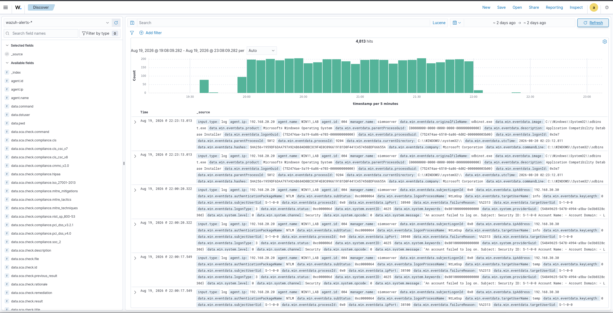

**1. Spotting the spike**

Rather than scroll through raw alerts, a line visualization was built using a date histogram on timestamp, filtered to manager.name: siemserver and rule.level between 0 and 16 so the full range of alert severities would be included. That visualization showed a clear, sustained spike in alert volume.

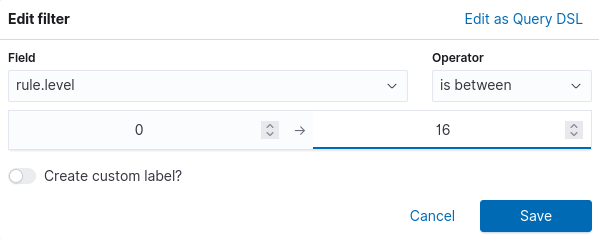
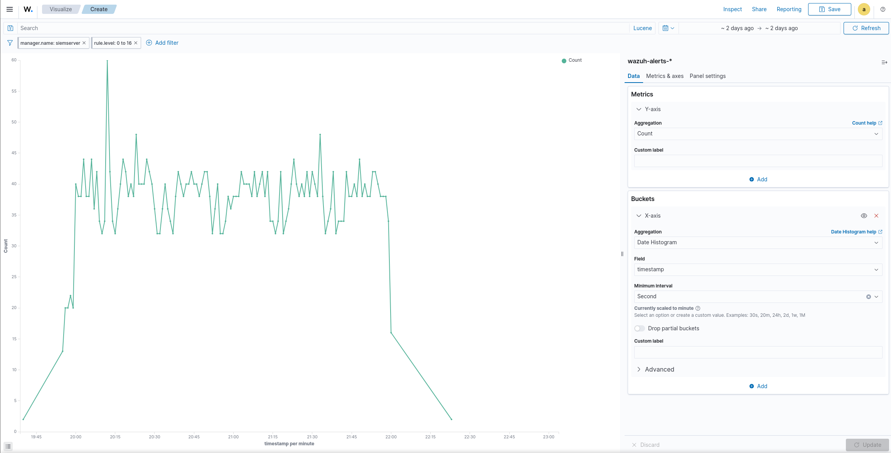

**2. Narrowing the time frame**

The spike was isolated to roughly *20:00 to 22:15* on August 19, so the Discover time range was narrowed to a window around that period for the rest of the investigation.

**3. Adding the source IP field**

The field data.win.eventdata.ipAddress was added to the table to break the alerts down by source.

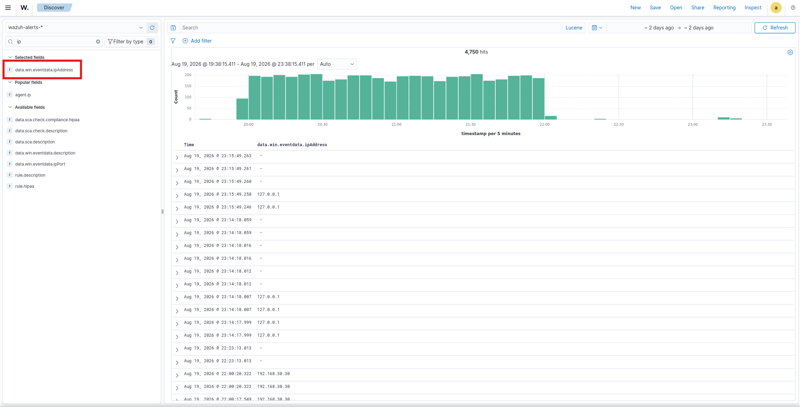

**4. Identifying the source**

The top values for that field showed *192.168.30.30* accounted for *98.8%* of the alerts carrying that field, immediately pointing the investigation at that single source.

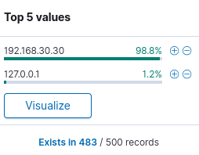

**5. Reviewing the raw alerts**

Expanding individual alerts from that source showed Event ID *4625*, authentication package NTLM, logon type 3 (network logon), and failure reason "Unknown user name or bad password" (status *0xC000006D*, sub status *0xC0000064*), with the source network address confirmed as 192.168.30.30.

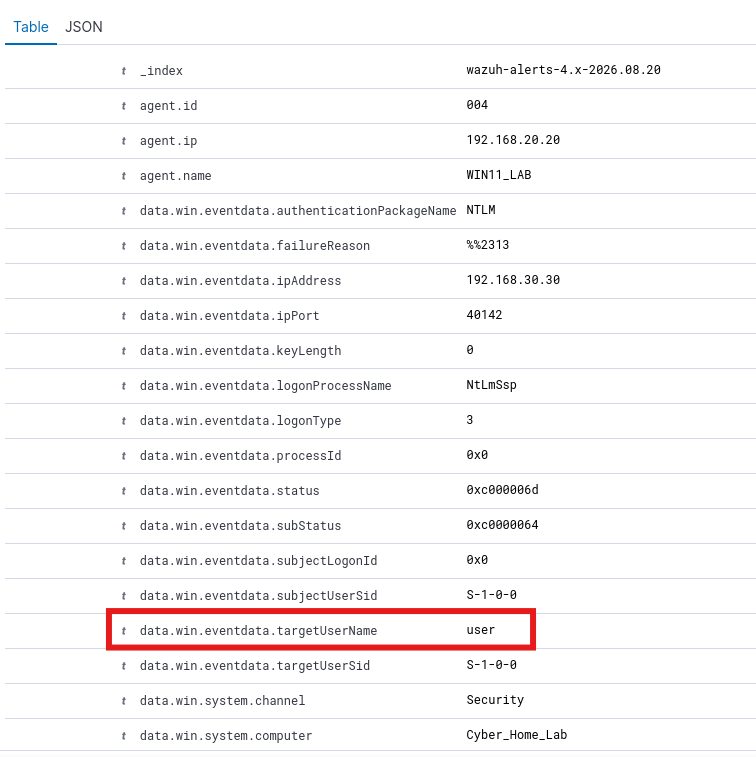
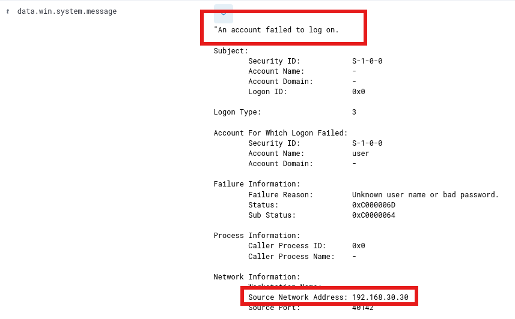

**6. Checking which accounts were targeted**

Sorting by data.win.eventdata.targetUserName showed the failed logons were spread evenly across roughly *25 different accounts*, each accounting for about *4%* of the activity, including generic and service style names such as info, temp, qa, dev, marketing, backup, dbadmin, helpdesk, and admin. A bar chart of the same field confirmed each targeted username received a near-identical count of attempts, around *190 to 200 each*.

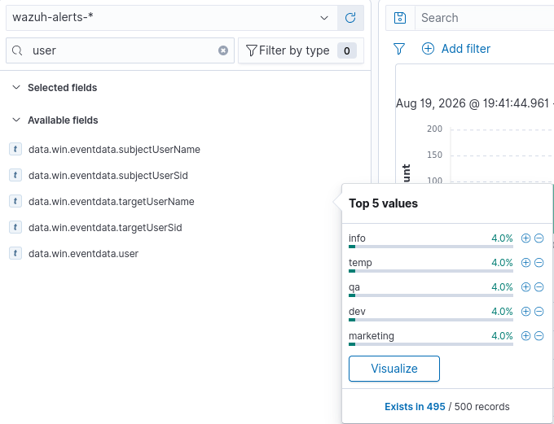
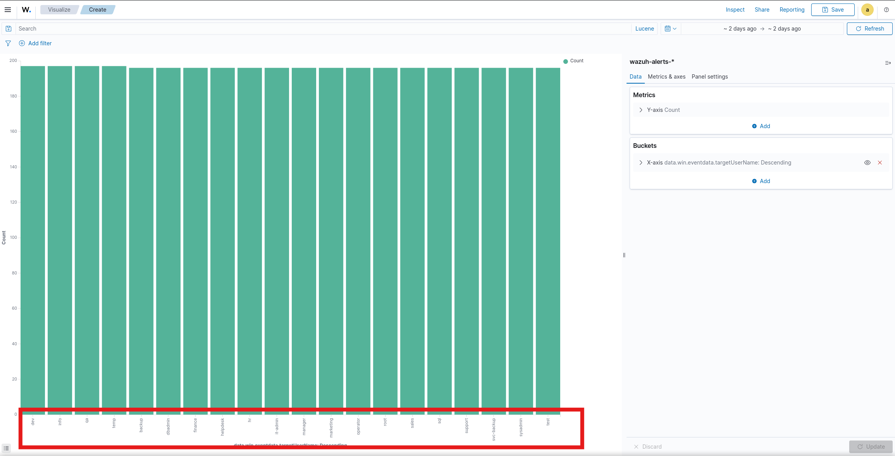

**7. Checking the MITRE mapping field**

Wazuh's built-in rule.mitre.id field showed *85.6%* of alerts tagged as *T1531* (Account Access Removal) and *13.4%* tagged as *T1110* (Brute Force), with small remainders for *T1078*, *T1484*, and *T1546.011*. The T1531 tagging lines up with the account lockout events generated once individual accounts crossed their lockout threshold from repeated bad passwords; it reflects a side effect of the spray rather than a deliberate attempt by the attacker to lock anyone out.

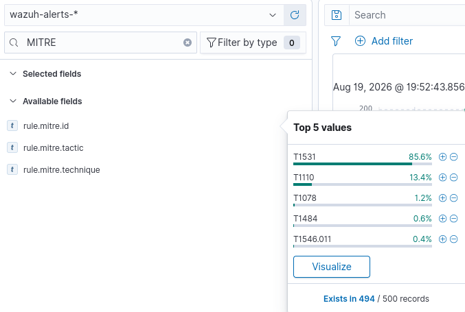

**8. Checking Windows Event IDs**

The data.win.system.eventID field showed *95.4%* Event ID *4625* (failed logon), and small percentages of *4624* (successful logon, *1.2%*), *4634* (logoff, *1.2%*), *4740* (account locked out, *1.2%*), and *4672* (special privileges assigned to new logon, *0.6%*).

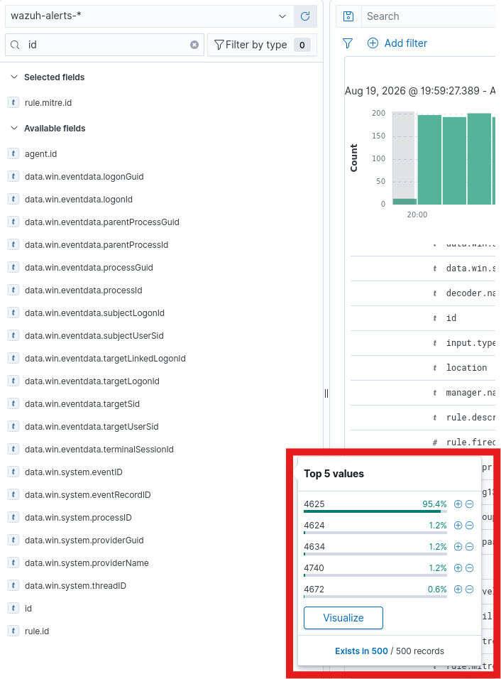

**9. Investigating the successful logons**

Filtering directly on Event ID 4624 returned only *6 hits total* across the entire search window. All 6 were timestamped *23:14 to 23:15* on August 19, over an hour after the attack window closed, all sourced from *127.0.0.1* rather than 192.168.30.30, and all against the Admin account. No 4624 event was ever recorded from the attacker's IP during the *20:00 to 22:15* attack window itself.

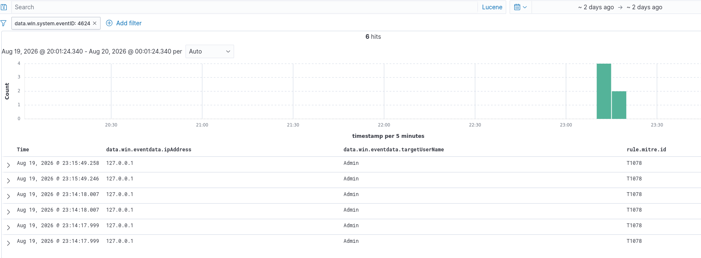

**10. Ruling out remaining leads**

The source port field (data.win.eventdata.ipPort) was checked for any pattern and showed only scattered ephemeral ports with no useful signal, so it was ruled out as a lead. After filtering out the 4625 failed logons, the unrelated 4624 successes just discussed, and other non meaningful housekeeping events, no further alerts of interest remained in the window.

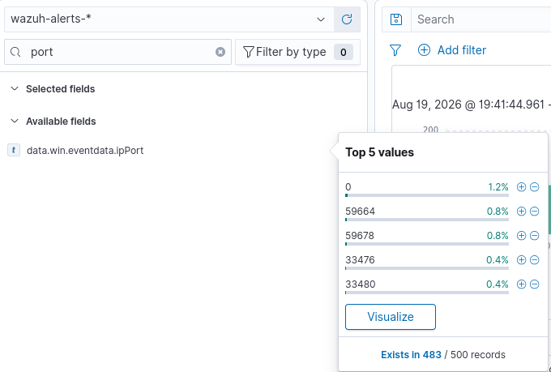
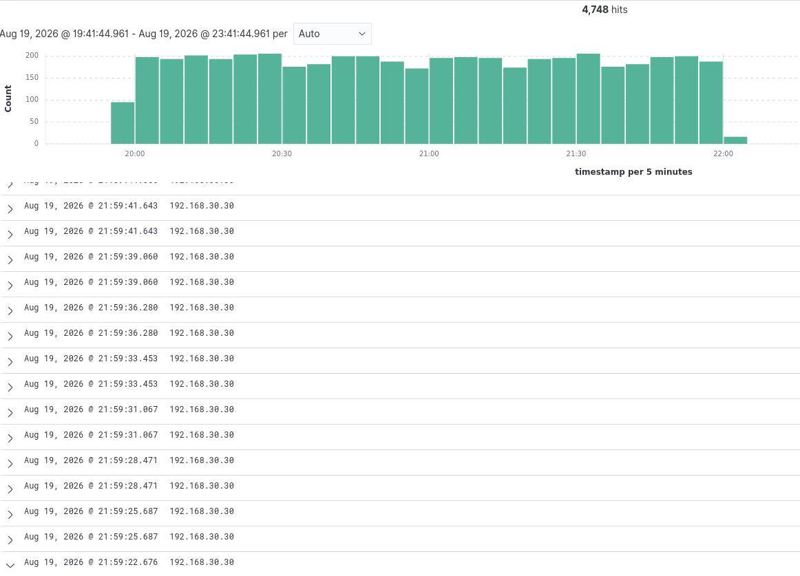

## Findings

- Roughly *4,750* alerts were generated between approximately *20:00* and *22:15* on August 19, 2026
- *98.8%* of alerts carrying a source IP were attributed to *192.168.30.30*
- *25* distinct local accounts were targeted in roughly equal proportion, consistent with a password-major spray pattern
- *95.4%* of events were Event ID *4625* (failed logon) over NTLM, logon type 3
- *1.2%* were Event ID *4740* (account lockout), triggered as accounts crossed their lockout threshold
- *1.2%* were Event ID *4624* (successful logon), but all *6* occurrences fell over an hour outside the attack window and originated from 127.0.0.1 against the Admin account, not from the attacker's IP
- No successful logon (*4624*) from 192.168.30.30 was found anywhere in the dataset during the attack window

## Threat Actor Assessment

No named threat actor or group is attributed here; that would not be an honest read of a lab exercise. Based purely on the observed behavior, the activity is consistent with a low-sophistication, opportunistic credential access actor:

- A single source IP was used throughout, with no proxying, rotation, or other evasion of source-based detection
- The targeted account list was broad and generic (admin, root, sql, temp, qa, and similar) rather than reconnaissance-driven or organization-specific
- The password major loop order (one password tried across all accounts before moving to the next) is a known technique to avoid tripping per-account lockout thresholds, and is common in commodity spray tooling
- No reconnaissance, lateral movement, privilege escalation, or persistence was observed beyond the login attempts themselves

This profile is consistent with commodity password spray tooling or an opportunistic initial access attempt, not a targeted or sophisticated adversary.

## MITRE ATT&CK Mapping

- Tactic: Credential Access
- Technique: *T1110*, Brute Force
- Sub technique: *T1110.003*, Password Spraying

Wazuh's automatic tagging split most alerts across *T1531* and *T1110* as described above, but *T1110.003* is the correct technique for the campaign as a whole. The T1531 tagging reflects the account lockouts that resulted from the spray rather than a separate objective.

## Remediation Recommendations

- Block *192.168.30.30* at the firewall
- Add a dedicated Failed Login Attempts panel to the SOC dashboard so future spikes in Event ID 4625 are immediately visible; this has already been built and saved as shown below
- Alert directly on Event ID *4740* (account lockout) given how strongly it correlated with this activity
- Review and reduce the generic and default local accounts available to be targeted (test, temp, qa, guest, and similar) where they are not actually needed
- Tune the account lockout threshold and duration so it still deters spraying without creating an easy denial of service condition against legitimate users

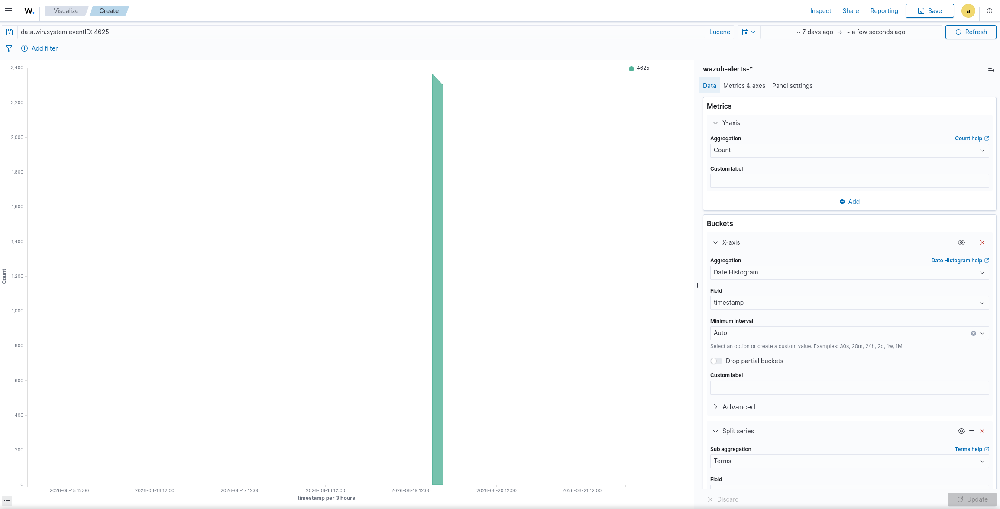
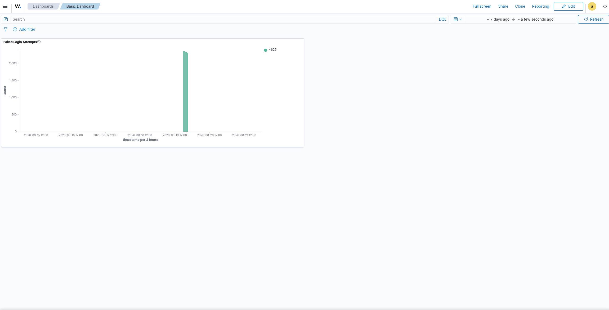

## Conclusion

The Windows 11 endpoint was targeted by a password spray attack against *25* local accounts from a single source, *192.168.30.30*, over roughly *two hours*. No successful authentication tied to that source IP was found anywhere in the Wazuh telemetry for the attack window. The only successful logons in the dataset occurred over an hour later, from localhost, against an unrelated account, and are attributed to normal local activity rather than the attacker.

**No breach occurred.** The endpoint was targeted but not compromised.

**Triage and escalate decision:** This alert should be triaged, not escalated. The technique and intent are clear (T1110.003), and the activity was fully visible in the logs, but there is no evidence of successful attacker authentication, lateral movement, or any post-exploitation activity. Standard handling applies: document the case, block the source IP, confirm the new dashboard panel and lockout alerting are in place, and close it as a detected and contained event. Escalation to a full incident response process is reserved for confirmed compromise or genuinely ambiguous findings, and neither applies here.
