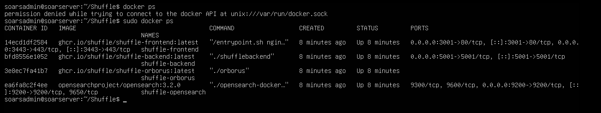
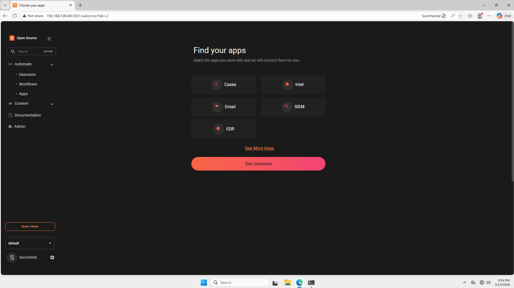

# Shuffle Setup

This document covers the installation and configuration of Shuffle on Ubuntu Server - SOAR. Shuffle is an open source SOAR platform used to automate alert response workflows. It receives alerts from Wazuh via webhook, enriches them with IOC data from VirusTotal and AbuseIPDB, creates cases in TheHive, and sends Slack notifications to the analyst.

## Why Shuffle

Shuffle was chosen as the SOAR platform for this lab for the following reasons:

**Open Source** - Shuffle is completely free and open source with no licensing restrictions, making it suitable for homelab use without cost.

**Visual Workflow Builder** - Shuffle provides a drag-and-drop workflow builder that makes it straightforward to build and understand automation logic without writing code.

**Native Integrations** - Shuffle has built-in integrations for Wazuh, TheHive, VirusTotal, AbuseIPDB, and Slack, covering every tool in this lab's pipeline without requiring custom development.

**Real World Relevance** - Shuffle is used in real SOC environments and demonstrates practical SOAR skills directly applicable to SOC analyst and engineer roles.

## Prerequisites

Before installing Shuffle, ensure Ubuntu Server - SOAR is fully installed, Docker is installed and running, and the static IP is configured. Full details are documented in [Ubuntu Server - SOAR Setup](soar-server-setup.md). Internet access through [pfSense](pfsense-setup.md) is required to pull the Shuffle Docker images during installation.

## Installation

Shuffle was installed on Ubuntu Server - SOAR by cloning the official Shuffle repository and starting the containers using Docker Compose. The official Shuffle repository can be found at [https://github.com/Shuffle/Shuffle](https://github.com/Shuffle/Shuffle).

**Step 1 - Clone the Shuffle repository:**
```bash
git clone https://github.com/Shuffle/Shuffle
cd Shuffle
```

**Step 2 - Start Shuffle using Docker Compose:**
```bash
docker compose up -d
```

This pulls all required Docker images and starts the Shuffle containers. The initial pull may take several minutes, depending on the internet speed.

**Step 3 - Verify Shuffle containers are running:**
```bash
docker ps
```

You should see several Shuffle containers all showing `Up` status.



## Accessing the Dashboard

The Shuffle dashboard is accessible from the Windows 11 VM browser at:
```
http://192.168.100.40:3001
```

On first access, Shuffle will prompt you to create an admin account. The following credentials were used:

| Field | Value |
|---|---|
| Email | admin@soc.local |
| Password | set during installation |

📸 Note - Shuffle does not send a verification email. Any email in a valid format works for account creation.



## Wazuh Integration

Wazuh is configured to forward alerts to Shuffle via a webhook trigger. When a qualifying alert fires in Wazuh, it sends the alert data to Shuffle, which begins the automation workflow.

### Step 1 - Create a Webhook Trigger in Shuffle

- In the Shuffle dashboard, navigate to **Workflows**
- Click **Create Workflow** and name it `Wazuh Alert Pipeline`
- In the workflow editor, drag a **Webhook** trigger onto the canvas
- Click the webhook trigger and copy the generated webhook URL - it will look like:
```
http://192.168.100.40:3001/api/v1/hooks/webhook_XXXXXXXX
```

📸 **Screenshot** - name it `shuffle-webhook.png` showing the webhook trigger with the URL visible.

### Step 2 - Configure Wazuh to Forward Alerts

On Ubuntu Server - SIEM, edit the Wazuh Manager configuration file:
```bash
sudo nano /var/ossec/etc/ossec.conf
```

Add the following integration block before the closing `</ossec_config>` tag:
```xml
<integration>
  <name>shuffle</name>
  <hook_url>http://192.168.100.40:3001/api/v1/hooks/webhook_XXXXXXXX</hook_url>
  <level>3</level>
  <alert_format>json</alert_format>
</integration>
```

Replace `webhook_XXXXXXXX` with your actual webhook URL copied from Shuffle. The `<level>3</level>` setting means only alerts of severity level 3 and above are forwarded to Shuffle.

Restart the Wazuh Manager to apply the change:
```bash
sudo systemctl restart wazuh-manager
```

📸 **Screenshot** - name it `shuffle-wazuh-integration.png` showing the ossec.conf integration block.

## IOC Enrichment

Shuffle is configured to automatically enrich incoming Wazuh alerts with threat intelligence data by querying VirusTotal and AbuseIPDB for the source IP address extracted from each alert.

### VirusTotal Integration

A free VirusTotal API key is required. Register at [https://www.virustotal.com](https://www.virustotal.com) to obtain a free API key.

In the Shuffle workflow editor:
- Add a **VirusTotal** app action after the webhook trigger
- Select the **Get IP Report** action
- Enter your VirusTotal API key in the authentication field
- Set the IP field to the source IP extracted from the Wazuh alert using the variable:
```
$exec.all_fields.data.srcip
```

📸 **Screenshot** - name it `shuffle-virustotal.png` showing the VirusTotal action configured in the workflow.

### AbuseIPDB Integration

A free AbuseIPDB API key is required. Register at [https://www.abuseipdb.com](https://www.abuseipdb.com) to obtain a free API key.

In the Shuffle workflow editor:
- Add an **AbuseIPDB** app action after the VirusTotal action
- Select the **Check IP** action
- Enter your AbuseIPDB API key in the authentication field
- Set the IP field to the same source IP variable:
```
$exec.all_fields.data.srcip
```

📸 **Screenshot** - name it `shuffle-abuseipdb.png` showing the AbuseIPDB action configured in the workflow.

## TheHive Integration

Shuffle is configured to automatically create a case in TheHive for each qualifying Wazuh alert, enriched with the IOC data from VirusTotal and AbuseIPDB.

### Step 1 - Add TheHive App to Workflow

In the Shuffle workflow editor:
- Add a **TheHive** app action after the AbuseIPDB action
- Select the **Create Alert** action
- Enter the TheHive URL:
```
http://192.168.100.40:9000
```
- Enter the Shuffle integration user API key generated in TheHive. Full details on the API key are documented in [TheHive Setup](thehive-setup.md)

### Step 2 - Configure Case Fields

Map the following fields from the Wazuh alert to the TheHive case:

| TheHive Field | Shuffle Variable |
|---|---|
| Title | `$exec.all_fields.rule.description` |
| Severity | `$exec.all_fields.rule.level` |
| Description | `$exec.all_fields.full_log` |
| Source IP | `$exec.all_fields.data.srcip` |

📸 **Screenshot** - name it `shuffle-thehive-integration.png` showing the TheHive action configured in the workflow.

## Slack Integration

Shuffle is configured to send a Slack notification to the analyst when a new case is created in TheHive.

### Step 1 - Create a Slack Workspace and Webhook

- Go to [https://slack.com](https://slack.com) and create a free workspace
- Create a channel named `#soc-alerts`
- Go to **Apps > Incoming Webhooks** and create a new webhook for the `#soc-alerts` channel
- Copy the webhook URL - it will look like:
```
https://hooks.slack.com/services/XXXXXXXX/XXXXXXXX/XXXXXXXX
```

### Step 2 - Add Slack App to Workflow

In the Shuffle workflow editor:
- Add a **Slack** app action after the TheHive action
- Select the **Send Message** action
- Enter your Slack webhook URL
- Configure the message to include key alert details:
```
New SOC Alert - $exec.all_fields.rule.description
Severity: $exec.all_fields.rule.level
Source IP: $exec.all_fields.data.srcip
TheHive Case Created - Investigate at http://192.168.100.40:9000
```

📸 **Screenshot** - name it `shuffle-slack-integration.png` showing the Slack action configured in the workflow.

## Complete Workflow

The completed Shuffle workflow connects all five steps into a single automated pipeline:
```
Wazuh Alert
    ↓
Webhook Trigger
    ↓
VirusTotal IOC Lookup
    ↓
AbuseIPDB IOC Lookup
    ↓
TheHive Case Created
    ↓
Slack Notification Sent
```

📸 **Screenshot** - name it `shuffle-workflow-complete.png` showing the full workflow canvas with all steps connected.

## Testing the Workflow

To verify the full pipeline is working, trigger a test alert from Kali Linux and confirm:

1. The alert appears in the Wazuh dashboard
2. Shuffle receives the webhook and runs the workflow
3. VirusTotal and AbuseIPDB return IOC data
4. A case is created in TheHive with enriched details
5. A Slack notification is received in the `#soc-alerts` channel

Full end-to-end testing is documented in the [SIEM to SOAR Automation project](../projects/01-siem-soar-automation/testing-and-results.md).

## Troubleshooting Encountered

### Shuffle Dashboard Not Loading

After starting the containers with `docker compose up -d` the Shuffle dashboard returned a connection refused error when accessed from the Windows 11 browser.

**Root cause:** Shuffle containers take several minutes to fully initialize after starting. The dashboard is not immediately available even when `docker ps` shows all containers as running.

**Resolution:** Waiting 3-5 minutes after container startup and retrying the browser resolved the issue.

## Configuration Notes

- Shuffle runs via Docker and starts automatically on boot
- The Shuffle dashboard is accessible at `http://192.168.100.40:3001`
- The Wazuh integration forwards alerts of severity level 3 and above to Shuffle
- VirusTotal free tier allows 4 API lookups per minute, which is sufficient for homelab usage
- AbuseIPDB free tier allows 1000 lookups per day, which is sufficient for homelab usage
- The complete workflow connects Wazuh, VirusTotal, AbuseIPDB, TheHive, and Slack in a single automated pipeline
- Full Shuffle documentation is available at [https://shuffler.io/docs](https://shuffler.io/docs)
