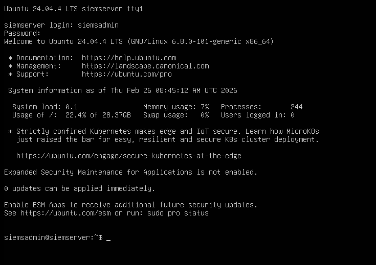
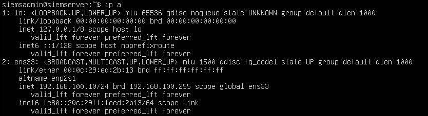
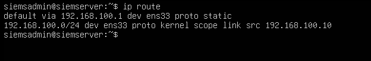
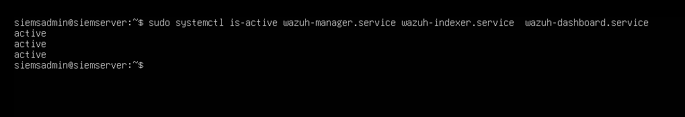

# Ubuntu Server - SIEM Setup

This document covers the installation and configuration of the Ubuntu Server - SIEM virtual machine in the SOC homelab. Ubuntu Server - SIEM serves as the SIEM host, running the full Wazuh stack, including the Wazuh Manager, Wazuh Indexer, and Wazuh Dashboard. Full Wazuh installation details are documented separately in [Wazuh Setup](wazuh-setup.md).

## VM Specifications

| Property | Value |
|---|---|
| Operating System | Ubuntu Server 24 |
| RAM | 4GB |
| CPUs | 2 |
| Storage | 80GB |
| Network Adapter | LAN Segment |
| IP Address | 192.168.100.10 |
| Gateway | 192.168.100.1 (pfSense) |
| Role | SIEM Server (Wazuh) |

## Installation

Ubuntu Server - SIEM was installed as a virtual machine in VMware Workstation using the official Ubuntu Server ISO. During installation, default settings were accepted with the exception of the network configuration, which was set to the LAN Segment after installation was complete. No desktop environment was installed - Ubuntu Server runs headless via terminal only, which reduces resource usage and reflects how servers are typically managed in real enterprise environments. The official Ubuntu Server ISO can be downloaded from the [Ubuntu official download page](https://ubuntu.com/download/server).

Storage was allocated at 80GB, more generously than the other VMs, to accommodate Wazuh log and alert data accumulation over time as lab exercises are performed.

### Ubuntu Server - SIEM Terminal

The screenshot below confirms the Ubuntu Server - SIEM VM is fully installed and operational.



## Network Configuration

A static IP address was manually assigned to the Ubuntu Server - SIEM VM to ensure consistent addressing within the LAN Segment. This is critical for Wazuh agent-to-manager communication - all agents on monitored endpoints are configured to point to this fixed IP address. The default gateway is set to 192.168.100.1, pointing to [pfSense](pfsense-setup.md). All internet-bound traffic from this machine routes through pfSense via VMware NAT. Internal traffic to other VMs stays on the LAN Segment and bypasses pfSense entirely.

### Static IP Assignment

| Property | Value |
|---|---|
| IP Address | 192.168.100.10 |
| Subnet Mask | 255.255.255.0 |
| Gateway | 192.168.100.1 |
| DNS | 192.168.100.1 (pfSense) |

The static IP address was assigned by editing the netplan configuration file:
```bash
sudo nano /etc/netplan/50-cloud-init.yaml
```

The following configuration was applied:
```yaml
network:
  ethernets:
    ens33:
      dhcp4: no
      addresses: [192.168.100.10/24]
      nameservers:
        addresses: [192.168.100.1]
      routes:
        - to: default
          via: 192.168.100.1
  version: 2
```

Changes were applied with:
```bash
sudo netplan apply
```

The screenshot below shows the output of `ip a` confirming the static IP address is active on the Ubuntu Server - SIEM VM.



The screenshot below shows the output of `ip route` confirming the default gateway is correctly set to 192.168.100.1.



## System Update

After installation, the system package list and all installed packages were updated to ensure the latest libraries and security patches are in place before Wazuh installation.
```bash
sudo apt update && sudo apt upgrade -y
```

## Wazuh Services

The full Wazuh stack is installed and running on Ubuntu Server - SIEM. All three Wazuh services are configured to start automatically on boot. Full installation details are documented in [Wazuh Setup](wazuh-setup.md).

To start Wazuh services manually after booting:
```bash
sudo systemctl start wazuh-manager
sudo systemctl start wazuh-indexer
sudo systemctl start wazuh-dashboard
```

The screenshot below confirms all three Wazuh services are active and running.



## Connectivity Verification

After static IP assignment, connectivity was verified across the most critical communication path for Ubuntu Server - SIEM. For full network connectivity verification across all critical lab communication paths, see [Static IP Configuration](../architecture/static-ip-configuration.md).

### Ubuntu Server - SIEM → Ubuntu Server - SOAR
Confirms the SIEM can forward alerts to the SOAR server. If this fails, no cases are created in TheHive.
```bash
ping 192.168.100.40
```


## Configuration Notes

- Ubuntu Server - SIEM runs headless with no desktop environment installed, reducing RAM and CPU overhead and leaving more resources available for the Wazuh stack
- 80GB storage was allocated specifically to accommodate Wazuh log data accumulation over time, as lab exercises are performed - this is the most storage-intensive VM in the lab
- All Wazuh services are set to start automatically on boot via systemctl enable, meaning the SIEM is fully operational as soon as the VM boots without manual intervention
- The Wazuh dashboard is accessible via browser from the Windows 11 VM at `https://192.168.100.10`
- Internet access is available through [pfSense](pfsense-setup.md) via VMware NAT for package updates and tool downloads as needed
