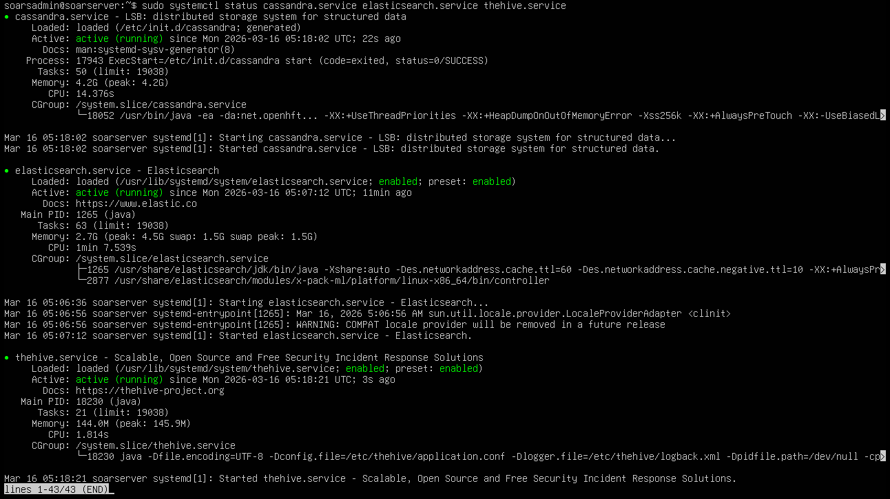

# Ubuntu Server - SOAR Setup

This document covers the installation and configuration of the Ubuntu Server - SOAR virtual machine in the SOC homelab. Ubuntu Server - SOAR serves as the SOAR host, running Shuffle for automated response workflows and TheHive for case management. Full installation details for each tool are documented separately in [Shuffle Setup](shuffle-setup.md) and [TheHive Setup](thehive-setup.md).

## VM Specifications

| Property | Value |
|---|---|
| Operating System | Ubuntu Server 24 |
| RAM | 20GB |
| CPUs | 4 |
| Storage | 80GB |
| Network Adapter | LAN Segment |
| IP Address | 192.168.100.40 |
| Gateway | 192.168.100.1 (pfSense) |
| Role | SOAR Server (Shuffle / TheHive) |

## Installation

Ubuntu Server - SOAR was installed as a virtual machine in VMware Workstation using the official Ubuntu Server ISO. During installation, the static IP, gateway, and DNS were configured directly through the installer network configuration screen. No desktop environment was installed - Ubuntu Server runs headless via terminal only, which reduces resource usage. The official Ubuntu Server ISO can be downloaded from the [Ubuntu official download page](https://ubuntu.com/download/server).

Storage was allocated at 80GB to accommodate TheHive case data and Docker container storage accumulation over time as lab exercises are performed.

### Ubuntu Server - SOAR Terminal

The screenshot below confirms the Ubuntu Server - SOAR VM is fully installed and operational.


## Network Configuration

A static IP address was assigned to the Ubuntu Server - SOAR VM during installation to ensure consistent addressing within the LAN Segment. The default gateway is set to 192.168.100.1, pointing to [pfSense](pfsense-setup.md). All internet-bound traffic from this machine routes through pfSense via VMware NAT, which is required for Docker installation, Slack notification delivery, and IOC enrichment queries to VirusTotal and AbuseIPDB. Internal traffic to other VMs stays on the LAN Segment and bypasses pfSense entirely.

### Static IP Assignment

| Property | Value |
|---|---|
| IP Address | 192.168.100.40 |
| Subnet Mask | 255.255.255.0 |
| Gateway | 192.168.100.1 |
| DNS | 192.168.100.1 (pfSense) |

The following configuration was applied during installation:

| Field | Value |
|---|---|
| Subnet | 192.168.100.0/24 |
| Address | 192.168.100.40 |
| Gateway | 192.168.100.1 |
| Name servers | 192.168.100.1 |
| Search domains | leave blank |

The screenshot below shows the output of `ip a` confirming the static IP address is active on the Ubuntu Server - SOAR VM.


The screenshot below shows the output of `ip route` confirming the default gateway is correctly set to 192.168.100.1.


## System Update

After installation, the system package list and all installed packages were updated to ensure the latest libraries and security patches are in place before tool installation.
```bash
sudo apt update && sudo apt upgrade -y
```

## Docker Installation

Docker is required to run Shuffle. Docker was installed on Ubuntu Server - SOAR using the official Docker convenience script, which automatically detects the OS, adds the repository, and installs Docker in a single command. The official Docker installation guide for Ubuntu can be found at the [Docker Engine Installation Guide](https://docs.docker.com/engine/install/ubuntu/).
```bash
curl -fsSL https://get.docker.com | sh
```

After installation, verify Docker is running:
```bash
sudo systemctl status docker
```

Expected output should show **active (running)**.


Add your user to the Docker group to run Docker commands without sudo:
```bash
sudo usermod -aG docker soarsadmin
newgrp docker
```

## SOAR Services

Shuffle and TheHive are installed and running on Ubuntu Server - SOAR. Shuffle runs via Docker and is configured to enrich incoming Wazuh alerts with IOC data from VirusTotal and AbuseIPDB before creating cases in TheHive and sending Slack notifications to the analyst. TheHive runs as a standalone service alongside Cassandra and Elasticsearch. Full installation details are documented in [Shuffle Setup](shuffle-setup.md) and [TheHive Setup](thehive-setup.md).

To verify Shuffle containers are running:
```bash
sudo docker ps
```

To verify that TheHive and its dependencies are running:
```bash
sudo systemctl status cassandra
sudo systemctl status elasticsearch
sudo systemctl status thehive
```

The screenshot below confirms all Shuffle containers are active and running.



## Connectivity Verification

After static IP assignment, connectivity was verified across the most critical communication path for Ubuntu Server - SOAR. For full network connectivity verification across all critical lab communication paths, see [Static IP Configuration](../architecture/static-ip-configuration.md).

### Ubuntu Server - SOAR → pfSense Gateway
Confirms the SOAR server can reach the gateway. If this fails, Slack notifications cannot be sent.
```bash
ping 192.168.100.1
```


## Configuration Notes

- Ubuntu Server - SOAR runs headless with no desktop environment installed, reducing RAM and CPU overhead and leaving more resources available for the SOAR stack
- 20GB RAM and 4 CPUs were allocated to meet the minimum requirements for TheHive, alongside Shuffle running simultaneously
- 80GB storage was allocated to accommodate TheHive case data and Docker container storage accumulation over time
- Shuffle containers are configured to start automatically on boot via Docker. TheHive, Cassandra, and Elasticsearch are configured to start automatically on boot via systemctl enable
- The Shuffle dashboard is accessible via browser from the Windows 11 VM at `http://192.168.100.40:3001`
- The TheHive dashboard is accessible via browser from the Windows 11 VM at `http://192.168.100.40:9000`
- Internet access is available through [pfSense](pfsense-setup.md) via VMware NAT for Docker installation, tool downloads, Slack notification delivery, and IOC enrichment queries to VirusTotal and AbuseIPDB
- Username on this VM is `soarsadmin`
