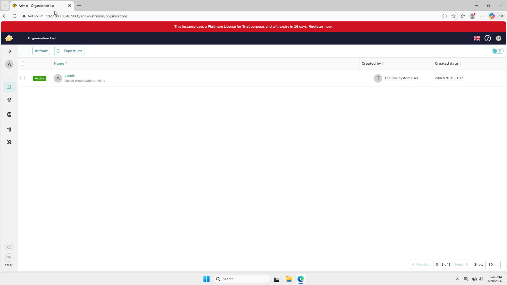

# TheHive Setup

This document covers the installation and configuration of TheHive on Ubuntu Server - SOAR. TheHive is an open source security incident response platform used for case management and investigation. It receives cases automatically from Shuffle when Wazuh generates alerts and provides a structured workflow for the SOC analyst to investigate and respond to incidents.

## Why TheHive

TheHive was chosen as the case management platform for this lab for the following reasons:

**Open Source** - TheHive is free and open source with a Community license available for homelab use. It provides enterprise-grade case management capabilities without licensing costs.

**SOAR Integration** - TheHive integrates natively with Shuffle, allowing cases to be created automatically from Wazuh alerts without manual intervention.

**Real World Relevance** - TheHive is widely used in real SOC environments and is directly relevant to SOC analyst job roles. Experience with TheHive translates directly to real-world skills.

**Structured Investigation Workflow** - TheHive provides a structured case management workflow including tasks, observables, and response actions that mirror how real SOC teams manage incidents.

## Prerequisites

Before installing TheHive, ensure Ubuntu Server - SOAR is fully installed, the static IP is configured, and the system packages have been updated. Full details are documented in [Ubuntu Server - SOAR Setup](soar-server-setup.md). Internet access through [pfSense](pfsense-setup.md) is required to download the TheHive installation script.

## TheHive Stack Components

TheHive relies on three components, all installed on Ubuntu Server - SOAR:

| Component | Description |
|---|---|
| Cassandra | NoSQL database used by TheHive to store case and alert data |
| Elasticsearch | Search and indexing engine used by TheHive for data retrieval |
| TheHive | Web-based case management platform and investigation interface |

## Installation

TheHive was installed using the official StrangeBee installation script, which automates the deployment of all three stack components. The official installation guide can be found at [TheHive Installation Guide](https://docs.strangebee.com/thehive/installation/).

Run the following command on Ubuntu Server - SOAR:
```bash
wget -q -O /tmp/install_script.sh https://scripts.download.strangebee.com/latest/sh/install_script.sh ; sudo -v ; bash /tmp/install_script.sh
```

When prompted, select option **2 - Install TheHive**. The script handles all dependency installation, service configuration, and initial setup automatically.

## Enabling Services on Boot

After installation, all three services were enabled to start automatically on boot:
```bash
sudo systemctl enable cassandra
sudo systemctl enable elasticsearch
sudo systemctl enable thehive
```

Verify all three are enabled:
```bash
sudo systemctl is-enabled cassandra
sudo systemctl is-enabled elasticsearch
sudo systemctl is-enabled thehive
```

All three should return `enabled`.

## Verifying Services

After installation, all three services were verified as active and running:
```bash
sudo systemctl status cassandra
sudo systemctl status elasticsearch
sudo systemctl status thehive
```


## Accessing the Dashboard

The TheHive dashboard is accessible from the Windows 11 VM browser at:
```
http://192.168.100.40:9000
```

Default credentials on first login:
- Username: `admin`
- Password: `secret`

Change the default password immediately after the first login.

### TheHive Dashboard



## Initial Configuration

### License Registration

TheHive installs with a 16-day Platinum trial license. A free Community license was requested from StrangeBee to replace the trial before expiry. The Community license can be requested at [StrangeBee Community Edition](https://www.strangebee.com/thehive/community-edition/).

Once the license key is received, apply it by navigating to:
```
Admin > License > Enter License Key
```

### Organisation Setup

A dedicated organisation was created for the lab:

- Go to **Admin > Organisations > Create Organisation**
- Name: `SOC-Homelab`
- Task sharing rule: `Manual`
- Observables sharing rule: `Manual`


### Shuffle Integration User

A dedicated service account was created for Shuffle to use when creating cases automatically:

| Field | Value |
|---|---|
| Login | shuffle@soc.local |
| Name | Shuffle Integration |
| Profile | analyst |
| Organisation | SOC-Homelab |

An API key was generated for this user and saved for use in the Shuffle workflow configuration. Full details on the Shuffle integration are documented in [Shuffle Setup](shuffle-setup.md).


## Starting TheHive After Reboot

TheHive services start automatically on boot. If manual startup is required, start the services in this exact order and wait between each:
```bash
sudo systemctl start cassandra
```

Wait 5 minutes, then:
```bash
sudo systemctl start elasticsearch
```

Wait 2 minutes, then:
```bash
sudo systemctl start thehive
```

TheHive will be accessible at `http://192.168.100.40:9000` within a few minutes of the service starting.

## Troubleshooting Encountered

### TheHive Failing on Startup with Exit Code

After initial installation, TheHive repeatedly failed to start with a `failed with result exit-code` error.

**Root cause:** TheHive was attempting to connect to Cassandra before Cassandra had fully initialized its keyspaces and was ready to accept connections.

**Resolution:** Starting Cassandra first and waiting 5 minutes before starting TheHive resolved the issue. The services were then enabled to start automatically on boot in the correct order using systemctl enable.

## Configuration Notes

- TheHive, Cassandra, and Elasticsearch are all set to start automatically on boot via systemctl enable
- TheHive uses a free Community license from StrangeBee - the license must be applied within 16 days of installation to prevent the instance from entering read-only mode
- The default admin password should be changed immediately after the first login
- Cassandra is the slowest service to initialize - always wait at least 5 minutes after Cassandra starts before attempting to access the TheHive dashboard
- Task sharing and observable sharing rules are set to Manual to mirror real SOC data handling practices
- Full TheHive documentation is available at [https://docs.strangebee.com](https://docs.strangebee.com)
