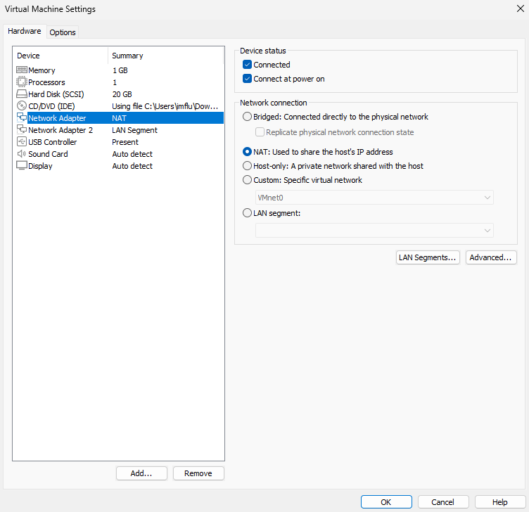
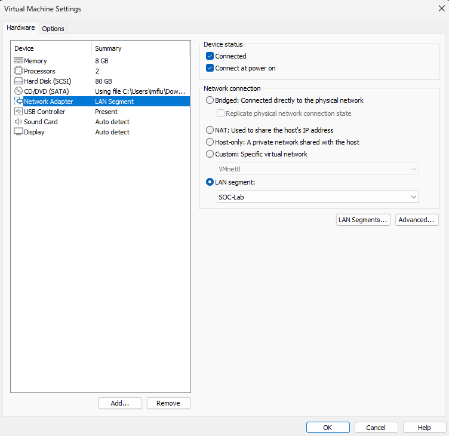

# VMware Setup

This document covers the VMware Workstation setup and configuration for the SOC homelab, including virtual machine hardware specifications, network setup, and security hardening of the VM environment. All five virtual machines are hosted on a single physical machine running VMware Workstation with 32GB RAM.

- [Download VMware Workstation](https://www.vmware.com/products/workstation-pro.html)

## Host Machine Specifications

| Property | Value |
|---|---|
| Hypervisor | VMware Workstation |
| Host RAM | 32GB |
| Network Type | LAN Segment |
| Subnet | 192.168.100.0/24 |
| DHCP | Disabled |
| Internet Access | Via pfSense NAT |

## Network Configuration

All five virtual machines are connected to a VMware **LAN Segment** - an isolated virtual network with no DHCP and no direct routing to the host machine's physical network. pfSense sits at the network perimeter with two network adapters - a WAN adapter connected to VMware NAT for internet access, and a LAN adapter connected to the internal LAN Segment. All VMs use pfSense at 192.168.100.1 as their default gateway, meaning all internet bound traffic is routed through pfSense before reaching the outside network. Internal VM to VM traffic stays on the LAN Segment and bypasses pfSense entirely.

A LAN Segment was chosen over Bridged networking specifically because it provides complete isolation between the guest VMs and the host machine's physical network, which is a critical requirement when running intentionally vulnerable configurations and offensive security tools. pfSense provides controlled internet access without exposing the internal lab network directly to the host network.

## Virtual Machine Configurations

### pfSense

The screenshot below shows the pfSense VM hardware configuration, including memory, processor allocation, and dual network adapter assignment. For full pfSense installation and configuration details see [pfSense Setup](pfsense-setup.md).

| Property | Value |
|---|---|
| Operating System | pfSense CE |
| RAM | 1GB |
| CPUs | 1 |
| Storage | 20GB |
| Network Adapter 1 | NAT (WAN) |
| Network Adapter 2 | LAN Segment (LAN) |
| IP Address | 192.168.100.1 |
| Role | Firewall / Router |

### Windows 11 Home

The screenshot below shows the Windows 11 VM hardware configuration, including memory, processor allocation, and network adapter assignment to the LAN Segment. For full Windows 11 installation and configuration details see [Windows 11 Setup](windows11-setup.md).

| Property | Value |
|---|---|
| Operating System | Windows 11 Home |
| RAM | 4GB |
| CPUs | 2 |
| Storage | 64GB |
| Network Adapter | LAN Segment |
| IP Address | 192.168.100.20 |
| Role | Target Endpoint |

### Kali Linux

The screenshot below shows the Kali Linux VM hardware configuration, including memory, processor allocation, and network adapter assignment to the LAN Segment. For full Kali Linux installation and configuration details see [Kali Linux Setup](kali-setup.md).

| Property | Value |
|---|---|
| Operating System | Kali Linux 2025.4 |
| RAM | 4GB |
| CPUs | 2 |
| Storage | 50GB |
| Network Adapter | LAN Segment |
| IP Address | 192.168.100.30 |
| Role | Attack Machine |

### Ubuntu Server - SIEM

The screenshot below shows the Ubuntu Server - SIEM VM hardware configuration, including memory, processor allocation, and network adapter assignment to the LAN Segment. For full installation and configuration details see [Ubuntu Server - SIEM Setup](siem-server-setup.md).

| Property | Value |
|---|---|
| Operating System | Ubuntu Server 24 |
| RAM | 4GB |
| CPUs | 2 |
| Storage | 80GB |
| Network Adapter | LAN Segment |
| IP Address | 192.168.100.10 |
| Role | SIEM Server (Wazuh) |

### Ubuntu Server - SOAR

The screenshot below shows the Ubuntu Server - SOAR VM hardware configuration, including memory, processor allocation, and network adapter assignment to the LAN Segment. For full installation and configuration details see [Ubuntu Server - SOAR Setup](soar-server-setup.md).

| Property | Value |
|---|---|
| Operating System | Ubuntu Server 24 |
| RAM | 8GB |
| CPUs | 2 |
| Storage | 80GB |
| Network Adapter | LAN Segment |
| IP Address | 192.168.100.40 |
| Role | SOAR Server (Shuffle / TheHive) |

## VM Security Hardening

To prevent accidental data leakage between the host machine and the guest VMs the following features were disabled on all five virtual machines.

### Shared Folders Disabled

Shared folders were disabled on all VMs to prevent files from being transferred between the host machine and the guest VMs. This ensures the lab environment remains fully contained.

### Drag and Drop and Clipboard Disabled

Drag and drop and clipboard sharing were disabled on all VMs to prevent accidental copying of sensitive data between the host and guest environments. This is particularly important given that offensive security tools and intentionally vulnerable configurations are running inside the VMs.

## Baseline Snapshots

After completing the initial configuration of each VM - including OS installation, network setup, user creation, and security hardening - a baseline snapshot was taken of all five machines. A second snapshot was taken after [Wazuh Agent](wazuh-agent-setup.md) installation, [Sysmon](sysmon-setup.md) installation, and intentional vulnerability configuration on Windows 11. For full details on the Wazuh stack installation see [Wazuh Setup](wazuh-setup.md).

These snapshots serve as clean restore points that can be used to roll back the lab environment to a known good state before running attack exercises.

| Snapshot | Description |
|---|---|
| Baseline | Taken immediately after OS installation and initial configuration |
| Pre-Exercise | Taken after full lab setup including Wazuh agent, Sysmon, and vulnerability configuration |

## Setup Notes

- Total RAM allocated across all five VMs is 21GB against a host with 32GB total and approximately 14GB normal usage - running all five VMs simultaneously is supported but Kali only needs to be active during attack exercises to preserve headroom
- Storage was allocated generously on both Ubuntu Server VMs at 80GB each - Ubuntu Server - SIEM to accommodate Wazuh log data and Ubuntu Server - SOAR to accommodate TheHive case data
- All VMs use static IP addresses with pfSense at 192.168.100.1 as the default gateway. For full IP assignment details see [Static IP Configuration](../architecture/static-ip-configuration.md)
- pfSense is the only VM with two network adapters - all other VMs have a single LAN Segment adapter
