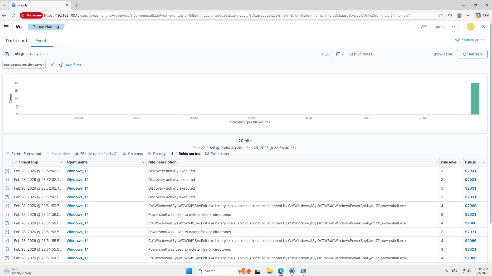
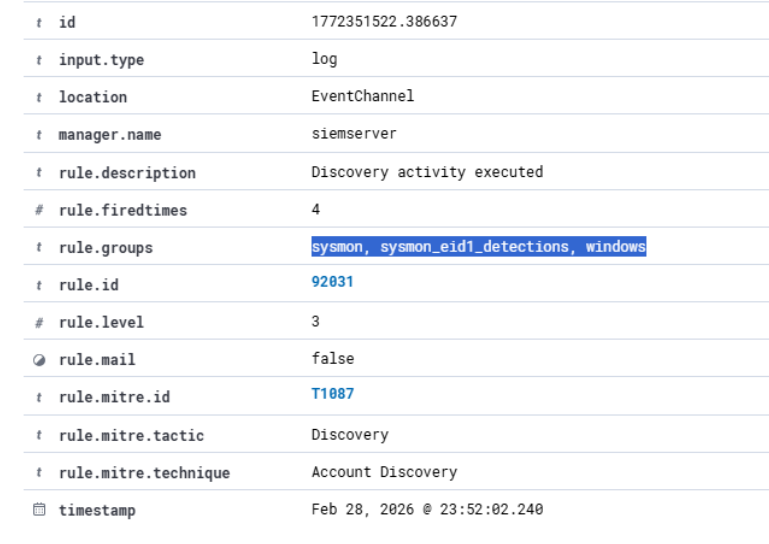

# Wazuh Agent Setup

This document covers the installation, configuration, and verification of the Wazuh agent on the Windows 11 target endpoint. The Wazuh agent is responsible for collecting security logs and telemetry from the endpoint and forwarding them in real time to the Wazuh Manager running on Ubuntu Server - SIEM at 192.168.100.10.

## Agent Overview

| Property | Value |
|---|---|
| Agent Installed On | Windows 11 Home (192.168.100.20) |
| Wazuh Manager IP | 192.168.100.10 |
| Agent Name | Windows_11 |
| Communication Port | 1514 (UDP) |

## Prerequisites

Before installing the agent ensure the Wazuh stack is fully installed and operational on Ubuntu Server - SIEM. Full installation details are documented in [Wazuh Setup](wazuh-setup.md).

Internet access for downloading the agent package from packages.wazuh.com is available through pfSense via VMware NAT. No network adapter changes are required prior to installation.

## Installation

The Wazuh agent was deployed through the Wazuh Dashboard on Ubuntu Server - SIEM. Navigate to:
```
Agents > Deploy New Agent > Windows
```

The dashboard generates a custom PowerShell command with the Wazuh Manager IP pre-configured. The command was run in PowerShell as Administrator on the Windows 11 VM:
```powershell
Invoke-WebRequest -Uri https://packages.wazuh.com/4.x/windows/wazuh-agent-4.14.3-1.msi -OutFile $env:tmp\wazuh-agent; msiexec.exe /i $env:tmp\wazuh-agent /q WAZUH_MANAGER='192.168.100.10' WAZUH_AGENT_NAME='Windows_11'
```

## Starting the Agent Service

After installation the Wazuh agent service was started via PowerShell as Administrator:
```powershell
NET START WazuhSvc
```

The agent service was also configured to start automatically on every system boot using:
```powershell
Set-Service -Name "WazuhSvc" -StartupType Automatic
```

### Service Running Screenshot


## Verifying Agent Connectivity

After installation agent connectivity to the Wazuh Manager was verified through the Wazuh Dashboard on Ubuntu Server - SIEM. The Windows 11 agent appears as **Active** in the agent list.

### Active Agent in Wazuh Dashboard


## Verifying Sysmon Log Collection

With the Sysmon localfile entry added to ossec.conf and the agent restarted, Sysmon events were confirmed flowing into the Wazuh dashboard. Full details on the Sysmon installation and ossec.conf configuration are documented in [Sysmon Setup](sysmon-setup.md).

### Sysmon Events in Dashboard View

The screenshot below shows the Wazuh Threat Hunting events page filtered by `rule.groups: sysmon`, confirming that Sysmon generated events are being received and processed by the Wazuh Manager from the Windows 11 agent.



### Expanded Sysmon Event Detail

The screenshot below shows an individual Sysmon event expanded to display its full details. The `rule.groups: sysmon` and `data.win.system.channel: Microsoft-Windows-Sysmon/Operational` fields confirm the event originated from Sysmon on the Windows 11 endpoint and was correctly parsed and categorized by the Wazuh Manager.



## Troubleshooting Encountered

### Issue - Sysmon logs not appearing in Wazuh dashboard

After installation Sysmon events were not appearing in the Wazuh dashboard despite the agent actively forwarding other Windows logs.

**Root cause:** The Sysmon log channel was not present in the ossec.conf configuration file by default. Wazuh does not automatically collect Sysmon logs without an explicit localfile entry pointing to the Sysmon event channel.

**Resolution:** The following entry was manually appended to ossec.conf to instruct the Wazuh agent to collect from the Sysmon event channel:
```xml
<localfile>
    <location>Microsoft-Windows-Sysmon/Operational</location>
    <log_format>eventchannel</log_format>
</localfile>
```

After saving the file the WazuhSvc service was restarted to apply the change:
```powershell
Restart-Service WazuhSvc
```

Sysmon events began appearing in the Wazuh dashboard immediately after the restart.

## Agent Log Location

The Wazuh agent logs on Windows are located at:
```
C:\Program Files (x86)\ossec-agent\ossec.log
```

These logs can be checked for connection errors or communication issues with the Wazuh Manager:
```powershell
type "C:\Program Files (x86)\ossec-agent\ossec.log"
```

## Configuration Notes

- The agent configuration file is located at `C:\Program Files (x86)\ossec-agent\ossec.conf`
- The Manager IP is set to 192.168.100.10 in the configuration file
- No custom agent configuration has been applied beyond default settings
- The agent collects Windows Event Logs and Sysmon logs which are forwarded to the Wazuh Manager in real time
- A future improvement is to configure custom log collection rules within ossec.conf to expand the scope of events collected
