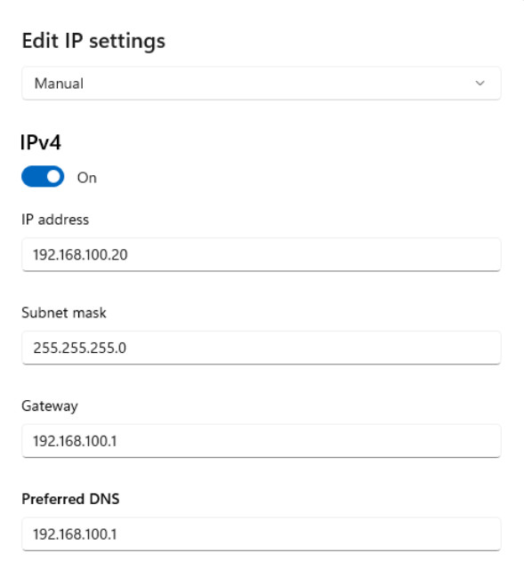
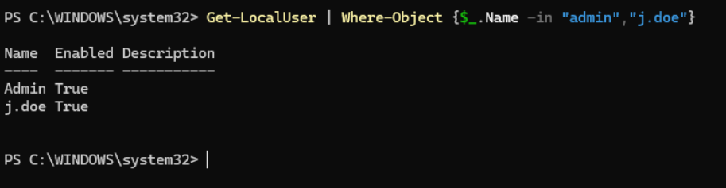
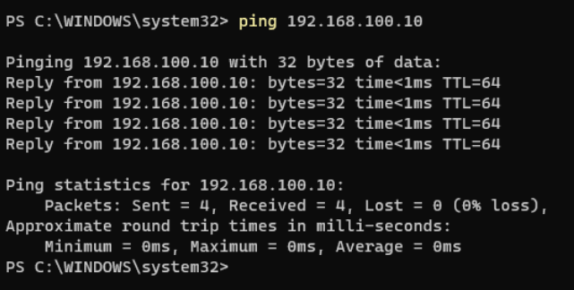
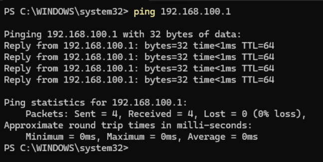

# Windows 11 Setup

This document covers the installation and configuration of the Windows 11 Home virtual machine in the SOC homelab. Windows 11 serves as the target endpoint, simulating a corporate workstation in a real-world environment. It is monitored by a Wazuh agent and intentionally weakened to allow realistic attack simulations from the Kali Linux attack machine.

## VM Specifications

| Property | Value |
|---|---|
| Operating System | Windows 11 Home |
| RAM | 4GB |
| CPUs | 2 |
| Storage | 64GB |
| Network Adapter | LAN Segment |
| IP Address | 192.168.100.20 |
| Gateway | 192.168.100.1 (pfSense) |
| Role | Target Endpoint |

## Installation

Windows 11 Home was installed as a virtual machine in VMware Workstation using the official Windows 11 ISO. During installation, a local account was created without linking to a Microsoft account to keep the environment self-contained and independent of any external services. The official Windows 11 ISO can be downloaded from [Microsoft's official download page](https://www.microsoft.com/software-download/windows11).

### Windows 11 Desktop

The screenshot below confirms the Windows 11 VM is fully installed and operational.


## Network Configuration

A static IP address was manually assigned to the Windows 11 VM to ensure consistent addressing within the LAN Segment. The default gateway is set to 192.168.100.1, pointing to [pfSense](pfsense-setup.md). All internet-bound traffic from this machine routes through pfSense via VMware NAT. Internal traffic to other VMs stays on the LAN Segment and bypasses pfSense entirely.

### Static IP Assignment

| Property | Value |
|---|---|
| IP Address | 192.168.100.20 |
| Subnet Mask | 255.255.255.0 |
| Gateway | 192.168.100.1 |
| DNS | 192.168.100.1 (pfSense) |

The static IP address was assigned by navigating to:
```
Settings > Network & Internet > Ethernet > Edit (next to IP Assignment) > Manual > IPv4
```

The screenshot below shows the Windows network settings confirming the static IP, gateway, and DNS have been correctly assigned to the Windows 11 VM.



## User Accounts

Two local user accounts were created on the Windows 11 VM to simulate a realistic corporate workstation environment with both a standard user and an administrator account.

| Account | Type | Purpose |
|---|---|---|
| admin | Administrator | Privileged account simulating a local administrator |
| j.doe | Standard User | Unprivileged account simulating a regular employee |

Both accounts were created as local accounts with no Microsoft account linking. The j.doe account is intentionally assigned a weak password to support brute force simulation exercises.

The screenshot below shows both accounts listed via PowerShell, confirming successful creation.



## Security Monitoring Stack

The Windows 11 VM has two security monitoring components installed that work together to collect and forward endpoint telemetry to the Wazuh Manager on Ubuntu Server - SIEM.

### Wazuh Agent

The Wazuh agent is installed and configured to forward Windows Event Logs and Sysmon logs to the Wazuh Manager at 192.168.100.10. Full installation details are documented in [Wazuh Agent Setup](wazuh-agent-setup.md).

### Sysmon

Sysmon is installed to significantly enhance the quality and detail of endpoint logs collected by the Wazuh agent. Full installation details are documented in [Sysmon Setup](sysmon-setup.md).

The screenshot below shows both services running and confirmed active on the Windows 11 VM.


## Connectivity Verification

After static IP assignment, connectivity was verified across the two most critical communication paths for the Windows 11 endpoint. For full network connectivity verification across all critical lab communication paths see [Static IP Configuration](../architecture/static-ip-configuration.md).

### Windows 11 → Ubuntu Server - SIEM
Confirms the Wazuh agent can reach the Wazuh Manager. If this fails, no logs are forwarded and no alerts fire.
```powershell
ping 192.168.100.10
```



### Windows 11 → pfSense Gateway
Confirms the target endpoint can reach the gateway. If this fails, the workstation has no internet access.
```powershell
ping 192.168.100.1
```



## Intentional Vulnerability Configuration

To allow realistic attack simulations from the [Kali Linux](kali-setup.md) machine, several default Windows 11 security controls were intentionally disabled. These changes are strictly contained within the lab environment and do not affect any external systems or networks. Each configuration change is documented below, along with the rationale for why it was applied.

### Windows Defender Real Time Protection Disabled
```powershell
Set-MpPreference -DisableRealtimeMonitoring $true
```

**Rationale:** Windows Defender blocks or quarantines most offensive security tools before they can execute. Disabling real time protection allows attack simulations from Kali to succeed and generate meaningful security events in Wazuh rather than being silently blocked at the endpoint.


### Windows Firewall Disabled
```powershell
netsh advfirewall set allprofiles state off
```

**Rationale:** The Windows Firewall blocks most inbound connection attempts by default, preventing network scanning and exploitation techniques from reaching the endpoint. Disabling it allows Kali to perform realistic network reconnaissance and exploitation exercises against the Windows VM.


### SMB Signing Disabled
```powershell
Set-SmbServerConfiguration -RequireSecuritySignature $false -Force
```

**Rationale:** Disabling SMB signing makes the Windows endpoint vulnerable to SMB relay and man-in-the-middle attacks, which are common techniques in real-world intrusions. This allows more advanced attack simulations involving SMB based exploitation.

### Weak Password on j.doe Account

**Rationale:** A weak password was assigned to the j.doe standard user account to allow brute force attack simulations to succeed within a reasonable timeframe. This simulates a common real world scenario where end users choose weak passwords that are vulnerable to credential attacks.

## Configuration Notes

- Windows 11 is running unactivated, which restricts access to some built-in management tools such as lusrmgr.msc. All configuration was performed via PowerShell as Administrator to work around this limitation
- All intentional vulnerability configurations are isolated to this VM on the LAN Segment and pose no risk to the host machine or external networks
- A pre-exercise snapshot was taken after all vulnerability configurations were applied, providing a clean restore point before running attack exercises
